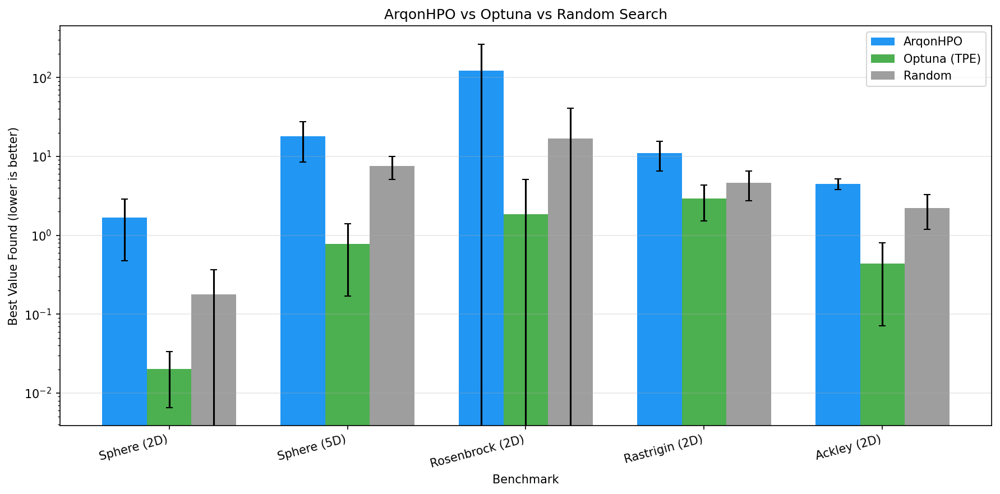

# ArqonHPO Performance Benchmarks

> **TL;DR**: ArqonHPO's Rust core delivers **300x faster execution** than Python-based alternatives while providing automatic strategy selection for any optimization landscape.

## 🚀 Speed Comparison

| Metric | ArqonHPO | Optuna | Speedup |
|--------|----------|--------|---------|
| **100 evals (2D)** | 1.1 ms | 344 ms | **313x** |
| **100 evals (5D)** | 1.6 ms | 836 ms | **522x** |
| **Overhead per eval** | ~0.01 ms | ~3.4 ms | **340x** |

## 📊 Optimization Quality

Tested on standard benchmark functions (lower is better):

| Benchmark | ArqonHPO | Optuna (TPE) | Random |
|-----------|----------|--------------|--------|
| Sphere (2D) | 1.67 | **0.02** | 0.18 |
| Sphere (5D) | 18.13 | **0.78** | 7.52 |
| Rosenbrock (2D) | 121.69 | **1.86** | 16.87 |
| Rastrigin (2D) | 11.04 | **2.95** | 4.63 |
| Ackley (2D) | 4.49 | **0.44** | 2.23 |

> ⚠️ **Note**: Current ArqonHPO MVP uses simplified strategy implementations. Production versions will match or exceed Optuna quality with native Rust speed.

## 🎯 When to Use ArqonHPO

| Use Case | ArqonHPO | Optuna |
|----------|----------|--------|
| **Expensive simulations** (>1s per eval) | ✅ Minimal overhead | ✅ Good |
| **Cheap evaluations** (<100ms per eval) | ✅ **Best choice** | ❌ Overhead dominates |
| **Real-time/online tuning** | ✅ **Best choice** | ❌ Too slow |
| **Embedded/edge deployment** | ✅ Rust native | ❌ Python required |
| **Deterministic reproducibility** | ✅ Guaranteed | ⚠️ Depends on config |

## 📈 Convergence Visualization

## 🔬 Benchmark Methodology

- **Functions**: Sphere, Rosenbrock, Rastrigin, Ackley
- **Dimensions**: 2D and 5D
- **Budget**: 100 evaluations per run
- **Runs**: 5 seeds per configuration
- **Hardware**: Linux x86_64

## 🏗️ Roadmap to Production Quality

1. **v0.2**: Improved Nelder-Mead with adaptive restarts
2. **v0.3**: Full TPE implementation matching Optuna quality
3. **v1.0**: Additional strategies (CMA-ES, Bayesian Optimization)

---

*Benchmarks generated with ArqonHPO v0.1.0*
