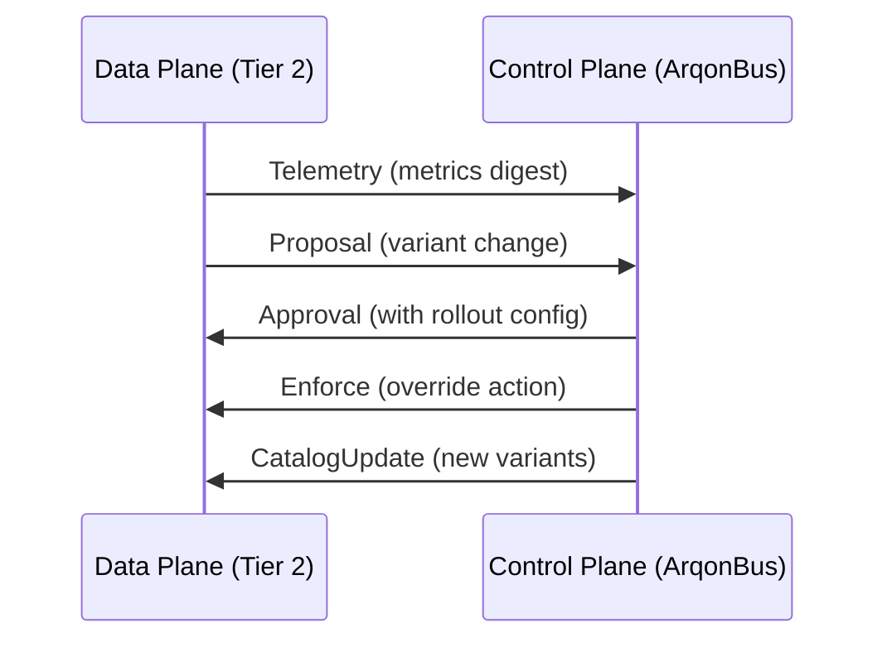

# Governance: ArqonBus Integration

> **Tier 1** is the safe executor that enforces approved variants through the ArqonBus control plane. It is the sole authorized writer to live state.

## Wire Protocol



## Upstream Messages (Data Plane → Control Plane)

### Telemetry
```rust
UpstreamMessage::Telemetry {
    timestamp_us: u64,
    node_id: String,
    metrics: HashMap<String, f64>,  // latency_p99, throughput, etc.
}
```

### Proposal
```rust
UpstreamMessage::Proposal {
    id: String,
    timestamp_us: u64,
    variant_id: Option<VariantId>,
    params: Option<HashMap<String, f64>>,
    reason: String,
    confidence: f64,  // 0.0 - 1.0
}
```

### Alert
```rust
UpstreamMessage::Alert {
    timestamp_us: u64,
    severity: AlertSeverity,  // Info, Warning, Error, Critical
    message: String,
    context: HashMap<String, String>,
}
```

## Downstream Messages (Control Plane → Data Plane)

### Approval
```rust
DownstreamMessage::Approval {
    proposal_id: String,
    proposal_digest: String,  // Ensures we approve what we think
    rollout: Option<RolloutConfig>,
}

pub struct RolloutConfig {
    pub initial_percent: f64,       // Start at X%
    pub increment_per_minute: f64,  // Ramp up
    pub max_percent: f64,           // Cap at Y%
}
```

### Enforcement
```rust
DownstreamMessage::Enforce {
    action: EnforcementAction,
    reason: String,
}

pub enum EnforcementAction {
    SetVariant(VariantId),         // Force specific variant
    SetParams(HashMap<String, f64>), // Force parameters
    EmergencyStop,                  // Reset to safe baseline
    PauseAdaptation,                // Freeze Tier 2
    ResumeAdaptation,               // Unfreeze
}
```

### Catalog Update
```rust
DownstreamMessage::CatalogUpdate {
    version: u64,
    source_uri: String,  // URL/path to fetch new catalog
}
```

## Rollout Tracker

Gradual traffic shifting for safe deployments:

```rust
pub struct RolloutTracker {
    config: RolloutConfig,
    current_percent: f64,
    started_at: Instant,
}

impl RolloutTracker {
    pub fn should_apply(&mut self) -> bool;  // Coin flip at current %
    pub fn step(&mut self);                  // Increment %
}
```

## Example Integration

```rust
// 1. Send proposal to ArqonBus
let proposal = UpstreamMessage::Proposal {
    id: "prop_001".to_string(),
    variant_id: Some(42),
    reason: "Latency regression detected".to_string(),
    confidence: 0.92,
    ..Default::default()
};
bus_client.send(proposal).await?;

// 2. Receive approval with gradual rollout
let approval = bus_client.recv().await?;
if let DownstreamMessage::Approval { rollout, .. } = approval {
    let tracker = RolloutTracker::new(rollout);
    
    // 3. Apply variant gradually
    for request in requests {
        if tracker.should_apply() {
            apply_new_variant(request);
        } else {
            apply_old_variant(request);
        }
    }
}

// 4. Handle emergency stop
if let DownstreamMessage::Enforce { action: EnforcementAction::EmergencyStop, .. } = msg {
    revert_to_safe_baseline();
    pause_all_adaptation();
}
```

## Safety Guarantees

1. **Digest Verification**: Approval includes digest to prevent TOCTOU bugs
2. **Gradual Rollout**: Limits blast radius of bad variants
3. **Emergency Stop**: Instant kill switch
4. **Pause Adaptation**: Freeze all Tier 2 changes
5. **Audit Trail**: All messages are serializable for logging
