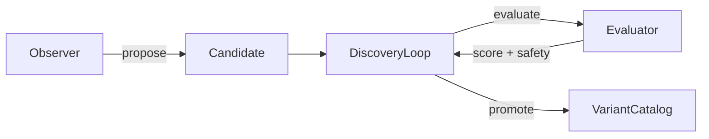

# Omega Tier: Offline Discovery Loop

> **Tier Ω** is the offline discovery system that generates, evaluates, and promotes new variant candidates. It runs outside the hot path and produces candidates for the online selection engine.

## Architecture



## Core Components

### Observer Trait
```rust
pub trait Observer {
    fn propose(&self, context: &ObserverContext) -> Option<Candidate>;
}
```

Sources of new candidates:
- **LLM Observer**: AI-generated architecture proposals
- **Genetic Algorithm**: Evolutionary search
- **Grid Search**: Systematic exploration
- **Heuristic**: Rule-based generation
- **Manual**: Human-designed variants

### Candidate
```rust
pub struct Candidate {
    pub id: String,
    pub source: DiscoverySource,
    pub variant: Variant,
    pub hypothesis: String,
}
```

### Evaluator Trait
```rust
pub trait Evaluator {
    fn evaluate(&self, candidate: &Candidate) -> EvaluationResult;
}

pub struct EvaluationResult {
    pub candidate_id: String,
    pub score: f64,           // Quality metric
    pub metrics: HashMap<String, f64>,
    pub passed_safety: bool,  // Critical safety gate
    pub duration_ms: u64,
}
```

### Discovery Loop
```rust
pub struct DiscoveryLoop<E: Evaluator> {
    evaluator: E,
    candidates: Vec<Candidate>,
    promoted: Vec<Variant>,
}

impl<E: Evaluator> DiscoveryLoop<E> {
    pub fn add_candidate(&mut self, candidate: Candidate);
    
    pub fn step(&mut self) -> Vec<Variant> {
        // For each candidate:
        // 1. Evaluate offline
        // 2. Check: passed_safety && score > 0.8
        // 3. Add metadata and promote
    }
}
```

## Promotion Criteria

A candidate is promoted only if **both** conditions are met:
1. `passed_safety == true` (hard safety gate)
2. `score > 0.8` (quality threshold)

Promoted variants receive metadata:
- `omega_score`: The evaluation score
- `omega_source`: Where the candidate came from

## Example Usage

```rust
// 1. Create evaluator (simulation or benchmark)
struct MyEvaluator;
impl Evaluator for MyEvaluator {
    fn evaluate(&self, cand: &Candidate) -> EvaluationResult {
        // Run offline simulation...
    }
}

// 2. Create discovery loop
let mut loop = DiscoveryLoop::new(MyEvaluator);

// 3. Add candidates from various sources
let observer = MockLlmObserver::new("gpt-4");
if let Some(cand) = observer.propose(&context) {
    loop.add_candidate(cand);
}

// 4. Run discovery step
let promoted = loop.step();

// 5. Add promoted variants to catalog
for var in promoted {
    catalog.add(var);
}
```

## Key Design Decisions

1. **Offline Only**: Never blocks the hot path
2. **Explicit Safety**: `passed_safety` is a separate check from score
3. **Source Tracking**: Every variant knows its origin
4. **Stateless Evaluation**: Each candidate evaluated independently
