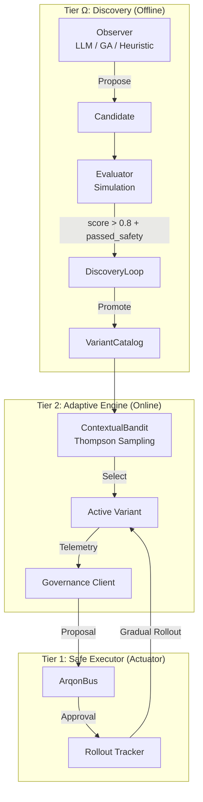

# Autopoiesis: Self-Creating & Self-Selecting Systems

> **Autopoiesis** (from Greek: auto = self, poiesis = creation) is ArqonHPO's architecture for systems that can create, evaluate, and select their own variants autonomously.

## Architecture Overview

The Autopoiesis system implements a three-tier architecture aligned with the Arqon Fabric:



## The Three Tiers

| Tier | Name | Role | Key Constraint |
|:---|:---|:---|:---|
| **Tier Ω** | Discovery | Invent new variants offline | Never in hot path |
| **Tier 2** | Adaptive Engine | Select best variant online | Time-budgeted |
| **Tier 1** | Safe Executor | Enforce approved variants | Sole writer to live state |

## Core Modules

### [Omega Tier](./omega_tier.md)
The offline discovery loop that generates and evaluates new candidates:
- **Observer**: Proposes candidates (LLM, GA, or heuristic)
- **Evaluator**: Runs offline simulation/benchmarking
- **DiscoveryLoop**: Generate → Evaluate → Promote pipeline

### [Variant Catalog](./variant_catalog.md)
The online selection engine using Thompson Sampling:
- **VariantCatalog**: Registry of approved variants with constraints
- **ContextualBandit**: Bayesian exploration/exploitation
- **Constraint Filtering**: Latency, memory, GPU, cost gates

### [Governance](./governance.md)
The wire protocol for ArqonBus integration:
- **UpstreamMessage**: Proposals, Telemetry, Alerts
- **DownstreamMessage**: Approvals, Enforcement, Catalog Updates
- **RolloutTracker**: Gradual traffic shifting

## Key Capabilities

### Self-Creation (Tier Ω)
```rust
let observer = MockLlmObserver::new("gpt-4");
let candidate = observer.propose(&context);

let mut loop = DiscoveryLoop::new(evaluator);
loop.add_candidate(candidate);
let promoted = loop.step();  // Only candidates passing safety get promoted
```

### Self-Selection (Tier 2)
```rust
let mut bandit = ContextualBandit::new(config);
let eligible = catalog.filter_eligible(latency_budget, memory, quality, cost, gpu);
let selection = bandit.select(&eligible, Some(default_id));
bandit.update(selection.variant_id, reward);  // Learn from feedback
```

### Governance (Tier 1)
```rust
// Propose a variant change
let proposal = UpstreamMessage::Proposal { ... };

// Receive approval with gradual rollout
let approval = DownstreamMessage::Approval {
    rollout: Some(RolloutConfig {
        initial_percent: 0.05,  // Start at 5%
        increment_per_minute: 0.1,
        max_percent: 1.0,
    }),
};
```

## Safety Guarantees

1. **Candidates never go directly to production** - must pass offline evaluation
2. **Score threshold** (0.8) ensures quality
3. **Safety gate** (`passed_safety`) for critical checks
4. **Constraint filtering** prevents invalid selections
5. **Gradual rollout** limits blast radius
6. **Emergency stop** for instant override

## Next Steps

- [Omega Tier Details](./omega_tier.md) - Discovery loop implementation
- [Variant Catalog Details](./variant_catalog.md) - Bandit algorithm deep-dive
- [Governance Protocol](./governance.md) - ArqonBus integration
