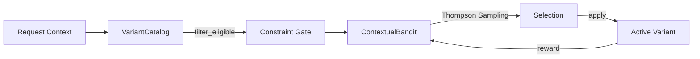

# Variant Catalog: Online Selection Engine

> **Tier 2** is the online adaptive engine that selects the best variant for each request using Thompson Sampling with constraint-based filtering.

## Architecture



## Core Components

### Variant
```rust
pub struct Variant {
    pub id: VariantId,
    pub name: String,
    pub version: String,
    pub variant_type: VariantType,
    pub constraints: VariantConstraints,
    pub expected_latency_us: u64,
    pub is_default: bool,
    pub metadata: HashMap<String, String>,
}

pub enum VariantType {
    Quantization,  // fp16, int8, int4
    Kernel,        // Compiled kernel variant
    EarlyExit,     // Depth profile
    Adapter,       // LoRA bundles
    RoutingPolicy, // MoE routing
    CachePolicy,   // KV-cache eviction
    Custom(String),
}
```

### Variant Constraints
```rust
pub struct VariantConstraints {
    pub max_latency_p99_us: Option<u64>,
    pub max_memory_bytes: Option<u64>,
    pub min_quality_score: Option<f64>,
    pub max_cost_per_request: Option<f64>,
    pub required_gpu_types: Vec<String>,
}
```

### Variant Catalog
```rust
pub struct VariantCatalog {
    variants: HashMap<VariantId, Variant>,
    by_type: HashMap<VariantType, Vec<VariantId>>,
}

impl VariantCatalog {
    pub fn add(&mut self, variant: Variant) -> VariantId;
    pub fn get(&self, id: VariantId) -> Option<&Variant>;
    pub fn by_type(&self, t: &VariantType) -> Vec<&Variant>;
    pub fn filter_eligible(
        &self,
        latency_budget: u64,
        memory_budget: u64,
        min_quality: f64,
        cost_budget: f64,
        gpu_type: &str,
    ) -> Vec<VariantId>;
}
```

### Contextual Bandit (Thompson Sampling)
```rust
pub struct ContextualBandit {
    rng: ChaCha8Rng,  // Deterministic
    config: BanditConfig,
    arms: HashMap<VariantId, ArmStats>,
}

pub struct BanditConfig {
    pub seed: u64,
    pub exploration_prob: f64,  // ε-greedy fallback
    pub prior_alpha: f64,       // Beta prior
    pub prior_beta: f64,
}

impl ContextualBandit {
    pub fn select(&mut self, eligible: &[VariantId], default: Option<VariantId>) 
        -> Option<Selection>;
    pub fn update(&mut self, variant_id: VariantId, reward: f64);
}
```

## Selection Algorithm

```
1. FILTER eligible variants via constraints
2. IF no eligible → fallback to default
3. IF only one eligible → return it
4. WITH probability ε → random exploration
5. ELSE Thompson Sampling:
   - For each arm: sample from Beta(α + successes, β + failures)
   - Select arm with highest sample
6. RETURN selection with reason
```

## Selection Reasons

```rust
pub enum SelectionReason {
    ThompsonSampling, // Bayesian selection
    Exploration,      // ε-greedy random
    OnlyEligible,     // Only one option
    Fallback,         // No eligible, use default
}
```

## Example Usage

```rust
// 1. Build catalog
let mut catalog = VariantCatalog::new();
catalog.add(Variant {
    name: "fp16".to_string(),
    variant_type: VariantType::Quantization,
    constraints: VariantConstraints {
        max_latency_p99_us: Some(500),
        ..Default::default()
    },
    is_default: true,
    ..Default::default()
});

// 2. Create bandit
let mut bandit = ContextualBandit::new(BanditConfig {
    seed: 42,
    exploration_prob: 0.1,
    ..Default::default()
});

// 3. Select variant
let eligible = catalog.filter_eligible(400, 1_000_000, 0.9, 0.01, "a100");
let selection = bandit.select(&eligible, Some(1)).unwrap();

// 4. Apply and observe reward
let reward = run_with_variant(selection.variant_id);
bandit.update(selection.variant_id, reward);
```

## Key Properties

1. **Deterministic**: ChaCha8Rng ensures reproducibility with same seed
2. **Constraint-First**: Invalid variants never considered
3. **Bayesian Learning**: Posterior updates naturally balance explore/exploit
4. **Graceful Degradation**: Fallback to default when no options
