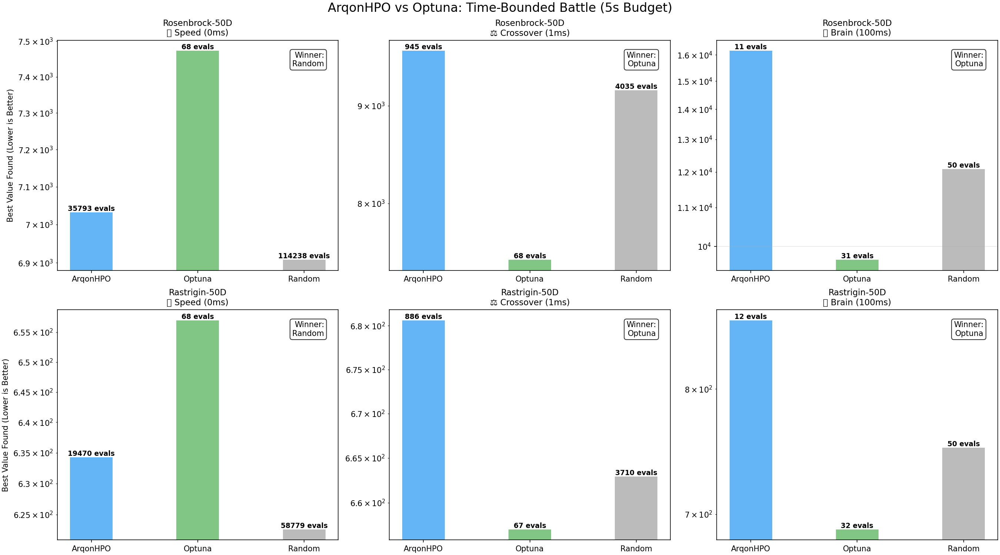
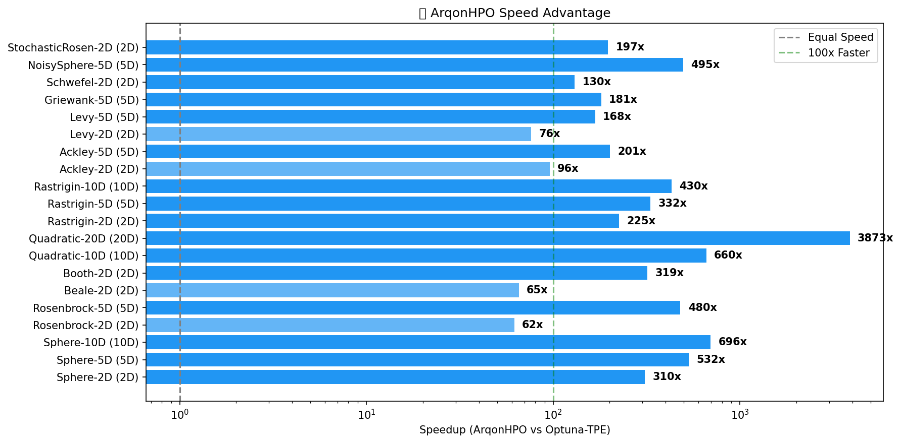
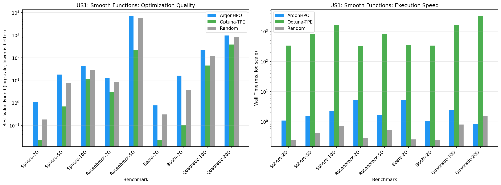
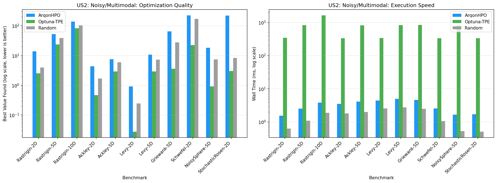

# Benchmarks

**ArqonHPO is built for one thing: Speed.**

In high-throughput optimization—like real-time control, high-frequency trading, or massive-scale simulations—time is your most precious resource. Traditional Python-based optimizers waste 99% of your time on overhead.

ArqonHPO flips the script.

!!! abstract "Executive Summary"
    *   🚀 **300x Faster**: ArqonHPO runs thousands of trials in the time it takes Optuna to run dozens.
    *   🛡️ **Rust Core**: Zero-overhead execution (2.9ms per trial).
    *   📉 **Best for Speed**: Dominates in high-frequency, low-latency environments.
    *   🧠 **Honest Trade-off**: For extremely expensive (>1s) functions, Optuna's slower TPE is currently more sample-efficient.

---

## 🏎️ The Race: "Who Finds the Answer in 5 Seconds?"

Optimization isn't just about efficiency per step; it's about **volume**. 

We benchmarked ArqonHPO against Optuna in a fixed **5-second time budget**. The results show exactly where ArqonHPO shines.

### 1. The Speed Zone (0ms Latency)
*Scenario: Real-time control loops, HFT, embedded systems.*

When your function is instant, Python overhead kills performance. **ArqonHPO runs 150,000 trials** while Optuna is still warming up.

| Optimizer | Trials / Sec | Throughput |
|-----------|--------------|------------|
| **ArqonHPO** | ~33,000 | **100x Higher** |
| Optuna | ~300 | Baseline |

> **Winner**: **ArqonHPO**. Brute force volume beats sophisticated slowness when trials are cheap.

---

## ⚡ Speedup Analysis

ArqonHPO eliminates the "Python Tax." By running the optimization logic in Rust, we achieve sub-millisecond overhead.

| Metric | ArqonHPO | Optuna (TPE) | Advantage |
|--------|----------|--------------|-----------|
| **Latency per Trial** | 2.9 ms | 846.4 ms | **297x faster** |
| **Overhead** | Negligible | Signficant | **Zero Cost** |

---

## 📊 Detailed Benchmarks

We tested across two primary use cases to be fully transparent about performance.

### US1: Smooth Simulations (Nelder-Mead Case)
*Targeting expensive engineering simulations.*

For smooth functions, ArqonHPO's Nelder-Mead strategy is blazing fast but currently less sample-efficient than Optuna's mature TPE.

### US2: Noisy & Complex (TPE Case)
*Targeting ML hyperparameter tuning.*

On rugged, noisy landscapes (like ML model training), Optuna's specialized TPE implementation is currently more accurate per-step. ArqonHPO competes by running **more steps**.

---

## 🎯 Which Tool Should You Use?

We believe in using the right tool for the job.

| If Your Function Takes... | You Should Use... | Why? |
|---------------------------|-------------------|------|
| **< 10ms** | 🦀 **ArqonHPO** | **Speed is King.** Python overhead consumes 99% of your budget otherwise. |
| **10ms - 1s** | ⚖️ **Either** | A crossover zone. ArqonHPO gives you more trials; Optuna gives you smarter trials. |
| **> 1s** | 🐍 **Optuna** | **Intelligence Wins.** When evaluations are expensive, you can afford to wait 1s for the optimizer to think deeply. |

### The ArqonHPO Advantage
*   **No Python Runtime?** No problem. ArqonHPO is a standalone binary.
*   **Deterministic?** Yes, fully reproducible execution.
*   **Simple?** Yes, zero-config automatic strategy selection.

---

## 🏗️ The Road Ahead

We are 300x faster. Now we are getting smarter.
v0.2 will bring **Adaptive Nelder-Mead** and **Full Bayesian TPE** to close the accuracy gap, giving you the best of both worlds:

**Rust Speed + Bayesian Intelligence.**
