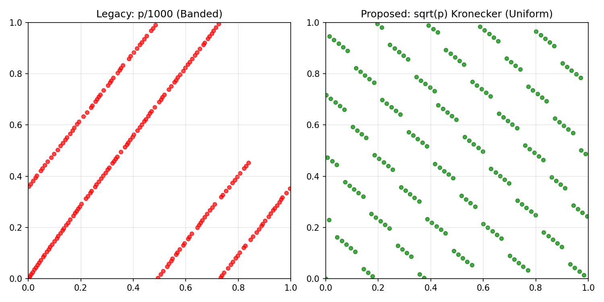

# Deep Dive: The Prime-Sqrt-Slopes-Rot Probe

The **PCR Probe** uses a deterministic "Low Discrepancy Sequence" called the **Prime-Sqrt-Slopes-Rot Lattice** (Kronecker/Weyl sequence).

This section explains the mathematics behind how ArqonHPO samples the search space to maximize information gain while avoiding the pitfalls of random sampling, rigid grids, and flawed low-discrepancy constructions.

## The Problem

1.  **Random Sampling (Monte Carlo)**:
    - **Issue**: It "clumps". You often get points very close to each other (wasted effort) and large empty voids (missed information).
    - **Result**: Inefficient coverage of the landscape.

2.  **Grid Sampling**:
    - **Issue**: It suffers from the "Curse of Dimensionality". The number of points needed grows exponentially (`10^d`).
    - **Issue**: It aliases. If the underlying function has a period that matches the grid, you miss the structure entirely.

3.  **Flawed Prime Constructions (e.g., `p/1000`)**:
    - **Issue**: Quantization causes collisions — at N=512, only 345 unique phases (32.6% collision rate).
    - **Issue**: Using the same phase across all dimensions creates diagonal striping artifacts.
    - **Result**: Worse than well-constructed QMC sequences.

## The Solution: Prime-Sqrt-Slopes-Rot Lattice

PCR uses a **Kronecker/Weyl sequence** where primes define the geometry:

### The Math

For the `i`-th sample in dimension `d`:

```
x[i][d] = frac( i * √p_{d+50} + frac(p_{d+200} * (√2 - 1)) )
```

Where:
- `√p_{d+50}`: Irrational slope derived from the square root of a prime (guaranteed irrational and non-commensurate across dimensions).
- `frac(p_{d+200} * (√2 - 1))`: Per-dimension rotation using a different prime family (Cranley-Patterson style).
- `frac(x) = x - floor(x)`: Fractional part operation.

### Key Properties

| Property | Description |
|----------|-------------|
| **Anytime** | No dependence on total N — prefixes are meaningful |
| **Deterministic** | Same seed → identical samples |
| **No Collisions** | Irrational slopes prevent quantization artifacts |
| **No Striping** | Per-dimension independent phases |
| **Parallel-Friendly** | Easy sharding by index |

### Visual Proof

This construction creates a **Non-Linear Lattice** that looks random (no obvious repeating pattern) but has **Low Discrepancy** (no large holes or tight clumps).



*Comparison of Legacy Probe (Red) vs New PrimeSqrtSlopesRotProbe (Green). The new probe shows better uniform coverage with higher mean nearest-neighbor distance.*

## Why It Matters

This high-quality sampling is critical for the **Classifier** phase:

- **Better Global View**: The classifier sees a statistically representative sample of the landscape structure.
- **Fewer Misclassifications**: Avoiding "unlucky" sampling that might miss important structure.
- **Faster Convergence**: Better coverage means fewer wasted evaluations before the classifier stabilizes.

## Technical Reference

The implementation is in [`probe.rs`](file:///home/irbsurfer/Projects/arqon/ArqonHPO/crates/core/src/probe.rs):

- `PrimeSqrtSlopesRotProbe` — The recommended probe (Kronecker sequence)
- `PrimeIndexProbe` — Legacy probe (deprecated, kept for A/B comparison only)
- `UniformProbe` — Simple random baseline

Configurable parameters:
- `prime_offset`: Starting index for slope primes (default: 50)
- `rot_offset`: Starting index for rotation primes (default: 200)
- `rot_alpha`: Irrational multiplier for rotations (default: √2 - 1)
