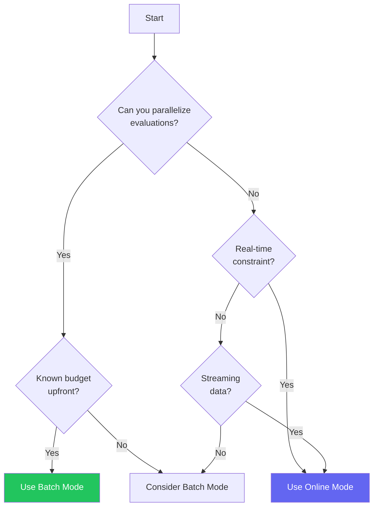

# Batch vs Online Mode

ArqonHPO supports two primary modes of operation: **Batch mode** for offline experimentation with parallel evaluation, and **Online mode** for real-time, streaming optimization.

---

## Mode Comparison

| Aspect                  | Batch Mode                       | Online Mode                  |
| ----------------------- | -------------------------------- | ---------------------------- |
| **Method**              | `ask()` / `tell()`               | `ask_one()` / `seed()`       |
| **Candidates per call** | Multiple (batch)                 | Single                       |
| **Algorithm**           | Full PCR (Probe-Classify-Refine) | Direct TPE (no probing)      |
| **Best for**            | Offline experiments, simulations | Real-time control, streaming |
| **Parallelism**         | Evaluate batch in parallel       | Sequential only              |

---

## Batch Mode (PCR Workflow)

Batch mode uses the full **Probe → Classify → Refine** workflow. The solver requests multiple candidates at once, evaluates them (potentially in parallel), and reports all results together.

### How It Works

1. **`ask()`** returns a batch of candidate configurations
2. You **evaluate** all candidates (can parallelize this step)
3. **`tell()`** reports all results back to the solver
4. Repeat until budget exhausted (returns `None`)

### Example

```python
from arqonhpo import ArqonSolver
import json

config = {
    "seed": 42,
    "budget": 100,
    "bounds": {"x": {"min": -5, "max": 5}, "y": {"min": -5, "max": 5}}
}

solver = ArqonSolver(json.dumps(config))
best = {"value": float('inf'), "params": None}

while True:
    # Get a BATCH of candidates
    batch = solver.ask()
    if batch is None:
        break

    # Evaluate all candidates (can parallelize!)
    results = []
    for i, params in enumerate(batch):
        value = objective(params)
        if value < best["value"]:
            best = {"value": value, "params": params}
        results.append({
            "eval_id": i,
            "params": params,
            "value": value,
            "cost": 1.0
        })

    solver.tell(json.dumps(results))

print(f"Best: {best}")
```

### Phase Breakdown

The batch mode budget is divided across three phases:

| Phase        | Budget % | What Happens                                                 |
| ------------ | -------- | ------------------------------------------------------------ |
| **Probe**    | ~20%     | Low-discrepancy sampling to explore the landscape            |
| **Classify** | 0%       | Analyze probe results; determine strategy (computation only) |
| **Refine**   | ~80%     | Execute selected strategy (Nelder-Mead or TPE)               |

The probe phase returns larger batches (to cover the search space), while the refine phase may return smaller batches depending on the selected strategy.

### When To Use Batch Mode

- ✅ You can evaluate multiple candidates in parallel
- ✅ Full budget is known upfront
- ✅ Offline experiments (training runs, simulations)
- ✅ You want automatic strategy selection via PCR

---

## Online Mode (Real-time Workflow)

Online mode bypasses the PCR workflow entirely. Each call returns exactly one candidate, and feedback is incorporated immediately before the next candidate is generated.

### How It Works

1. **`ask_one()`** returns a single candidate configuration
2. You **evaluate** immediately
3. **`seed()`** reports the result back
4. Repeat until budget exhausted (returns `None`)

### Example

```python
from arqonhpo import ArqonSolver
import json

config = {
    "seed": 42,
    "budget": 100,
    "bounds": {"gain": {"min": 0.1, "max": 10.0}}
}

solver = ArqonSolver(json.dumps(config))

while True:
    # Get ONE candidate
    candidate = solver.ask_one()
    if candidate is None:
        break

    # Evaluate immediately
    value = evaluate_in_production(candidate)

    # Feed back immediately
    solver.seed(json.dumps([{
        "params": candidate,
        "value": value,
        "cost": 1.0
    }]))
```

### Key Differences from Batch Mode

| Aspect                      | Batch Mode                        | Online Mode                  |
| --------------------------- | --------------------------------- | ---------------------------- |
| **Probe phase**             | Yes (20% of budget)               | Skipped                      |
| **Classification**          | Automatic                         | None (always TPE)            |
| **Strategy**                | NM or TPE based on classification | TPE only                     |
| **Sample efficiency**       | Higher (benefits from probing)    | Lower (no exploration phase) |
| **Latency to first result** | Higher (batch evaluation)         | Lower (immediate feedback)   |

### When To Use Online Mode

- ✅ Real-time control loops (adjusting parameters while system runs)
- ✅ Single evaluations at a time (can't parallelize)
- ✅ External evaluation systems (A/B testing, user feedback)
- ✅ Streaming data sources
- ✅ Continuous operation without defined budget

---

## Choosing Between Modes

### Decision Tree



### Practical Guidelines

| Scenario                                  | Recommended Mode |
| ----------------------------------------- | ---------------- |
| Training ML models on a cluster           | Batch            |
| Tuning a live web server                  | Online           |
| Hyperparameter search with Ray/Spark      | Batch            |
| Adjusting game AI parameters in real-time | Online           |
| Simulation optimization                   | Batch            |
| A/B testing with user feedback            | Online           |

---

## Hybrid Approach

You can combine both modes. This is useful when you want the benefits of batch probing but need to switch to online refinement:

```python
solver = ArqonSolver(json.dumps(config))

# Phase 1: Batch probing for landscape exploration
for _ in range(3):
    batch = solver.ask()
    if batch:
        results = parallel_evaluate(batch)
        solver.tell(json.dumps(results))

# Phase 2: Switch to online refinement
while True:
    candidate = solver.ask_one()
    if candidate is None:
        break
    value = evaluate_single(candidate)
    solver.seed(json.dumps([{
        "params": candidate,
        "value": value,
        "cost": 1.0
    }]))
```

This approach:

- Uses batch mode to efficiently explore the search space
- Switches to online mode for fine-grained, real-time refinement
- Maintains all history across both phases

---

## API Reference

### Batch Mode Methods

| Method               | Description                                                         |
| -------------------- | ------------------------------------------------------------------- |
| `ask()`              | Returns `List[Dict]` of candidates, or `None` when budget exhausted |
| `tell(results_json)` | Reports evaluation results for all candidates in the batch          |
| `get_history_len()`  | Returns total number of evaluations completed                       |

### Online Mode Methods

| Method               | Description                                                      |
| -------------------- | ---------------------------------------------------------------- |
| `ask_one()`          | Returns single `Dict` candidate, or `None` when budget exhausted |
| `seed(results_json)` | Reports evaluation result (works for single or multiple results) |

---

## Next Steps

<div class="grid cards" markdown>

- :zap: **[Quickstart](../quickstart.md)**

  Get running with batch or online mode

- :gear: **[Strategies](strategies.md)**

  Algorithm details for NM and TPE

- :dna: **[Metabolic Architecture](metabolic_architecture.md)**

  Online mode for self-tuning systems

</div>

---
