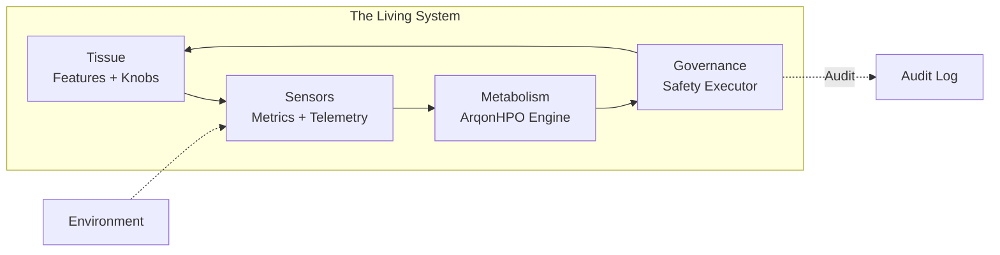

# Metabolic Architecture

### **When optimization becomes continuous, software becomes alive.**

When ArqonHPO is applied to every feature knob in a system, the software begins to exhibit **organism-like** capabilities. It moves from being a static machine to a self-regulating entity with an internal "metabolism" for performance and reliability.

This document explores the philosophy, mechanics, and practical implications of building systems with pervasive, continuous optimization.

---

## The Problem with Static Configuration

Traditional software is built with static constants:

```python
TIMEOUT = 300
BATCH_SIZE = 64
CACHE_TTL = 3600
RETRY_LIMIT = 3
```

These constants represent assumptions about traffic, hardware, and environment that are often **wrong the moment the system deploys**—and become increasingly wrong as conditions change.

### The Drift Problem

Every production system experiences drift:

| Drift Type            | Example                            | Impact                                        |
| --------------------- | ---------------------------------- | --------------------------------------------- |
| **Traffic drift**     | Organic growth, viral events       | Timeouts become too short, batches too large  |
| **Hardware drift**    | New instance types, degraded disks | Constants tuned for old hardware underperform |
| **Environment drift** | New dependencies, network topology | Latency assumptions become invalid            |
| **Workload drift**    | Schema changes, query patterns     | Cached values become suboptimal               |

The traditional response? Wait for an alert, investigate, and manually retune. This reactive approach is **slow, expensive, and error-prone**.

---

## The Organism Metaphor

A **Metabolic Architecture** replaces static assumptions with dynamic policies. By exposing every control knob to ArqonHPO, you give the system the ability to:



| Component      | Biological Analog          | ArqonHPO Component                  |
| -------------- | -------------------------- | ----------------------------------- |
| **Tissue**     | Cells performing functions | Features with exposed control knobs |
| **Sensors**    | Nervous system             | Telemetry digests (≤128 bytes)      |
| **Metabolism** | Hormonal regulation        | Solver + PCR algorithm              |
| **Governance** | Homeostatic reflexes       | SafetyExecutor + Guardrails         |

### Sense → Synthesize → Regulate

The metabolic loop operates continuously:

1. **Sense**: Telemetry flows from the data plane to the control plane
2. **Synthesize**: ArqonHPO finds the optimal operating point for current conditions
3. **Regulate**: SafetyExecutor applies bounded adjustments to maintain stability

This isn't optimization-as-a-task. This is **optimization-as-a-capability**.

---

## Homeostasis vs. Traditional Optimization

In a metabolic architecture, optimization isn't something you _do_—it's something the system _is_.

| Aspect             | Traditional Optimization      | Metabolic Architecture          |
| ------------------ | ----------------------------- | ------------------------------- |
| **Frequency**      | Monthly / Quarterly           | Every few seconds               |
| **Trigger**        | Performance regression, alert | Continuous telemetry stream     |
| **Decision maker** | Engineer with dashboard       | Autonomous control loop         |
| **Logic**          | Manual analysis + retuning    | PCR algorithm                   |
| **Speed**          | Hours to days                 | Milliseconds                    |
| **Result**         | Static fix (until next drift) | Dynamic resilience              |
| **Failure mode**   | Unnoticed degradation         | Bounded, recoverable adjustment |

### The Thermostat Analogy

Your home thermostat doesn't wait for you to notice it's cold. It continuously senses temperature and adjusts the heating system to maintain a setpoint. If external conditions change (door opens, weather shifts), it adapts automatically.

A metabolic system works the same way, but for _every_ tunable parameter.

---

## The Metabolic Feedback Loop

### 1. Tissue (Features)

Your application features expose control knobs:

```rust
// Traditional: static constant
const BATCH_SIZE: usize = 64;

// Metabolic: dynamic control knob
fn get_batch_size() -> usize {
    CONFIG.read("batch_size") as usize  // Controlled by ArqonHPO
}
```

**Exposable knobs** include:

- Cache TTLs, sizes, eviction policies
- Batch sizes, queue depths
- Timeout durations, retry limits
- Thread pool sizes, connection limits
- Sampling rates, aggregation windows
- Feature flag thresholds

### 2. Sensors (Metrics)

Real-time telemetry feeds into the solver via `TelemetryDigest`:

```rust
// Constitution: II.19 - MUST be ≤128 bytes
struct TelemetryDigest {
    timestamp_us: u64,        // When this was measured
    config_generation: u64,   // Which config produced this
    objective_value: f64,     // The thing we're optimizing
    // Optional auxiliary metrics...
}
```

Key properties:

- **Compact**: ≤128 bytes for cache-line efficiency
- **Timestamped**: Enables causality tracking
- **Generational**: Links telemetry to specific configurations

### 3. Metabolism (ArqonHPO)

The engine processes telemetry and synthesizes adjustments:

1. **Validate** incoming telemetry (generation match, freshness)
2. **Collect** valid digests into a window
3. **Evaluate** objective from aggregated telemetry
4. **Propose** parameter adjustments via active strategy (NM, TPE, SPSA)

The PCR algorithm (Probe-Classify-Refine) adapts the strategy to the detected landscape:

- **Structured landscapes** (smooth, unimodal): Nelder-Mead for fast convergence
- **Chaotic landscapes** (noisy, multimodal): TPE for robust exploration

### 4. Governance (Safety)

The `SafetyExecutor` ensures the "organism" never enters a state of shock.

The SafetyExecutor acts as a governance layer between the optimizer and your running system. While the optimizer proposes changes, the SafetyExecutor validates each proposal before allowing it to take effect.

Before any parameter change is applied to your running system, the SafetyExecutor checks:

1. **Is this value allowed?** — The proposed value must be within the defined min/max bounds
2. **Is the change too big?** — Even if the final value is valid, jumping there in one step might be dangerous
3. **Are we changing too fast?** — Rapid-fire updates can cause instability
4. **Are we currently in "safe mode"?** — If something went wrong recently, all updates are frozen until things stabilize

Only after passing all these checks does the change actually get applied. And every decision—approved or rejected—is logged so you can see exactly what happened and why.

**Why this matters:** Without governance, an optimizer could theoretically decide that setting your timeout to 1 millisecond is "optimal" based on recent data. The SafetyExecutor prevents that kind of catastrophic misconfiguration.

```rust
// Every update passes through guardrails
impl SafeExecutor for SafetyExecutor {
    fn apply(&mut self, proposal: Proposal) -> Result<ApplyReceipt, Violation> {
        // 1. Bounds check
        // 2. Delta check (max change per update)
        // 3. Rate limit (max updates per second)
        // 4. Control safety (not in SafeMode)
        // 5. Apply to atomic config
        // 6. Log to audit trail
    }
}
```

**Guardrails prevent**:

| Risk                 | Guardrail    | Mechanism            |
| -------------------- | ------------ | -------------------- |
| Parameter explosion  | Bounds       | Clamp to valid range |
| Wild oscillation     | Delta limits | Cap change magnitude |
| Feedback instability | Rate limits  | Cap update frequency |
| Cascading failure    | SafeMode     | Freeze all updates   |

---

## Control Safety: The Immune System

Beyond basic guardrails, ArqonHPO implements **control safety**—an immune system that detects and responds to pathological behavior.

### Thrashing Detection

Thrashing occurs when parameters oscillate rapidly without converging. The `ControlSafety` module tracks:

- **Direction flips**: How often a parameter changes direction
- **Delta budget**: Cumulative change within a time window

```rust
// If a parameter flips direction N times in T microseconds → SafeMode
if direction_flips >= guardrails.max_direction_flips {
    self.enter_safe_mode(SafeModeReason::Thrashing, now_us, cooldown_us);
}
```

### Regression Detection

If the objective consistently gets worse, the system enters SafeMode:

```rust
// N consecutive regressions → SafeMode
if consecutive_regressions >= rollback_policy.max_consecutive_regressions {
    self.enter_safe_mode(SafeModeReason::ObjectiveRegression, now_us, cooldown_us);
}
```

### SafeMode

When triggered, SafeMode **freezes all updates** until:

- A cooldown timer expires
- Manual reset by operator
- Objective recovery is detected

This provides automatic protection against runaway feedback loops.

---

## Building a Metabolic System

### Step 1: Identify Control Knobs

Audit your system for tunable parameters:

```python
# Example: A web service with multiple knobs
CONTROL_KNOBS = {
    "connection_pool_size": {"min": 1, "max": 100},
    "request_timeout_ms": {"min": 100, "max": 30000},
    "cache_ttl_seconds": {"min": 1, "max": 3600},
    "batch_size": {"min": 1, "max": 500},
    "retry_limit": {"min": 0, "max": 10},
}
```

### Step 2: Define the Objective

What should the system optimize for?

```python
def objective(telemetry: TelemetryDigest) -> float:
    # Example: Minimize latency while keeping error rate low
    latency_score = telemetry.p99_latency_ms / 1000.0
    error_penalty = telemetry.error_rate * 100.0
    return latency_score + error_penalty
```

Common objectives:

| Objective                | Formula                    |
| ------------------------ | -------------------------- |
| Minimize latency         | `p99_latency`              |
| Maximize throughput      | `-requests_per_second`     |
| Balance latency + errors | `latency + error_rate * k` |
| Resource efficiency      | `cost_per_request`         |

### Step 3: Connect Telemetry

Stream real-time metrics to ArqonHPO:

```python
# Every N seconds, push telemetry
digest = TelemetryDigest(
    timestamp_us=now_us(),
    config_generation=current_generation,
    objective_value=objective(current_metrics),
)
solver.ingest_telemetry(digest)
```

### Step 4: Apply with Guardrails

Use SafetyExecutor to apply changes:

```python
proposal = solver.propose()
result = executor.apply(proposal)

if result.is_err():
    log_violation(result.error())
else:
    apply_to_system(result.new_config())
```

### Step 5: Monitor and Tune Guardrails

Start conservative, then relax as you gain confidence:

```python
# Phase 1: Ultra-conservative (first week)
guardrails = Guardrails.preset_conservative()

# Phase 2: Balanced (after stability proven)
guardrails = Guardrails.preset_balanced()

# Phase 3: Aggressive (offline benchmarks only)
guardrails = Guardrails.preset_aggressive()
```

---

## Case Study: The Self-Tuning Cache

Consider a cache with a fixed TTL of 300 seconds. This was optimal during initial testing but:

- During peak traffic, items expire too quickly → cache misses spike
- During quiet hours, stale data persists → freshness degrades
- When upstream latency increases, cache should retain longer

**Metabolic solution**:

```python
# Expose TTL as a control knob
config = {
    "bounds": {
        "cache_ttl_seconds": {"min": 30, "max": 900}
    }
}

# Objective: minimize (miss_rate + staleness_penalty)
def objective(metrics):
    miss_penalty = metrics.cache_miss_rate * 10.0
    stale_penalty = metrics.stale_hit_rate * 5.0
    return miss_penalty + stale_penalty
```

**Result**: TTL automatically increases during peak traffic (more caching) and decreases during quiet periods (fresher data).

---

## Why Build This Way?

### 1. Solve the Drift Problem

Systems naturally degrade as conditions change. A metabolic architecture doesn't just survive drift—it **consumes it**, adapting its internal state to remain optimal without human intervention.

### 2. Reduce Operational Burden

Instead of responding to alerts and manually retuning, operators define objectives and guardrails once. The system handles the rest.

### 3. Enable Continuous Improvement

Every second of operation generates data that improves the model. The system gets _better_ over time, not worse.

### 4. Build in Resilience

With SafeMode, rollback policies, and bounded updates, metabolic systems fail gracefully. A bad configuration doesn't crash the system—it triggers automatic recovery.

---

## Anti-Patterns to Avoid

| Anti-Pattern                            | Why It's Bad             | Alternative                         |
| --------------------------------------- | ------------------------ | ----------------------------------- |
| **Unbounded knobs**                     | Can cause system failure | Always define min/max bounds        |
| **No delta limits**                     | Wild oscillations        | Limit change per update             |
| **Ignoring telemetry lag**              | Optimizing stale data    | Use config generation for causality |
| **Too many knobs at once**              | Exploration explosion    | Start with 2-3 critical knobs       |
| **No SafeMode**                         | Runaway feedback loops   | Always enable control safety        |
| **Aggressive guardrails in production** | System instability       | Start conservative                  |

---

## The Vision: Software as Organism

The ultimate metabolic system doesn't just tune parameters—it:

- **Perceives** its environment through rich telemetry
- **Learns** optimal operating points for each regime
- **Adapts** seamlessly as conditions change
- **Heals** when things go wrong
- **Evolves** over time as it accumulates experience

This is the future of infrastructure: not static machines that humans tune, but living systems that tune themselves.

---

## Next Steps

<div class="grid cards" markdown>

- :shield: **[Safety & Guardrails](safety.md)**

  Deep dive into SafetyExecutor, violations, and rollback policies

- :brain: **[PCR Algorithm](pcr_algorithm.md)**

  How ArqonHPO adapts strategy to your problem

- :chart_with_upwards_trend: **[Strategies](strategies.md)**

  Nelder-Mead, TPE, and SPSA explained

- :zap: **[Batch vs. Online](batch_vs_online.md)**

  Choosing the right optimization mode

</div>

---

<div align="center">

_"The measure of intelligence is the ability to change."_ — Albert Einstein

</div>
