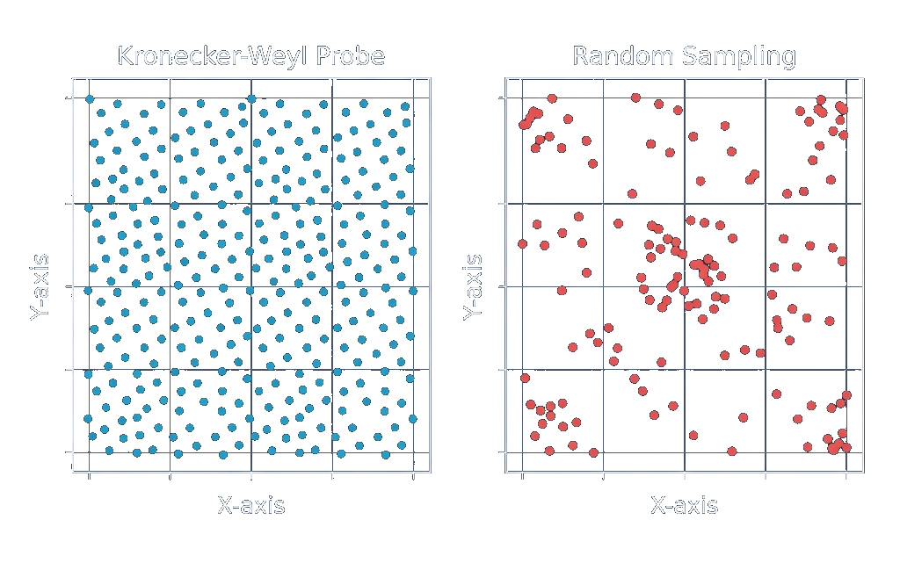

# Deep Dive: The Kronecker-Weyl Probe

The **Kronecker-Weyl Probe** uses a mathematically rigorous **Low-Discrepancy Sequence** to sample the search space.

This section explains the mathematics behind how ArqonHPO samples the search space to maximize information gain while avoiding the pitfalls of random sampling and rigid grids.

## The Problem

1.  **Random Sampling (Monte Carlo)**:
    - **Issue**: It "clumps". You often get points very close to each other (wasted effort) and large empty voids (missed information).
    - **Result**: Inefficient coverage of the landscape.

2.  **Grid Sampling**:
    - **Issue**: It suffers from the "Curse of Dimensionality". The number of points needed grows exponentially (`10^d`).
    - **Issue**: It aliases. If the underlying function has a period that matches the grid, you miss the structure entirely.

3.  **Legacy p/1000 Heuristic** (DEPRECATED):
    - **Issue**: `primes[i] / 1000` produces collisions and striping artifacts.
    - **Result**: Wasted budget on duplicate regions.

## The Solution: Kronecker Sequence with Prime Square Root Slopes

ArqonHPO v2 uses the **PrimeSqrtSlopesRotProbe**—a Kronecker/Weyl sequence with irrational slopes derived from prime square roots.

### The Math

For the `i`-th sample in dimension `d`:

```
sample[i][d] = fract( i × √prime[d] + shift[d] )
```

Where:

- `√prime[d]`: The square root of the `d`-th prime (2, 3, 5, 7, 11...). Irrational slopes prevent collisions.
- `shift[d]`: Optional Cranley-Patterson shift for QMC randomization.
- `fract(x)`: The fractional part of `x` (wraps to [0, 1)).

### Key Properties

| Property           | Description                                                   |
| :----------------- | :------------------------------------------------------------ |
| **Anytime**        | Quality of first K samples does NOT depend on total N         |
| **Collision-Free** | √prime slopes are mutually irrational—no aliasing             |
| **Deterministic**  | Same (seed, index) always produces same point                 |
| **Shardable**      | Stateless: workers can generate disjoint ranges independently |

### Robustness Hedge

A configurable `random_spice_ratio` (default 10%) of uniform random points hedges against multimodal fragility.

### Periodic Dimension Support

For dimensions marked as `Scale::Periodic` (angles, phases), the probe uses toroidal topology:

- `wrap01(x)`: Wrap to [0, 1)
- `diff01(a, b)`: Shortest signed distance in circular space
- `circular_mean01(values)`: Mean via sin/cos averaging

## Visual Proof

The Kronecker sequence creates a **Low-Discrepancy Lattice**. It looks random (no obvious repeating pattern) but fills space uniformly.



_Comparison of Kronecker Probe (Blue) vs Uniform Random (Red). Note how Blue covers uniformly without clumping or gaps._

## Why It Matters

High-quality probe data is critical for the **Classifier** phase:

- Uniform coverage avoids misclassifying structured landscapes as chaotic.
- Anytime property allows early stopping without quality degradation.
- Sharding enables parallel probing on expensive objectives.

## Constitution Reference

Per **Constitution v1.1.0 Section II.12**:

- Kronecker/Weyl sequences are REQUIRED.
- The legacy `p/1000` heuristic is BANNED.
- Cranley-Patterson shifts are the approved randomization mechanism.

---
