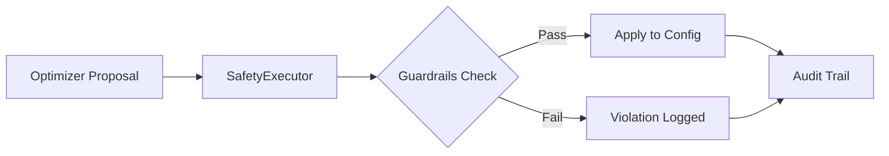

# Safety & Guardrails

**Optimization without governance is an incident waiting to happen.**

In a traditional "Human-in-the-Loop" workflow, safety is implicit: an engineer looks at a graph, thinks "that looks risky," and decides not to deploy the change. When you move to an **autonomous** optimization loop, that implicit judgment must be made explicit, rigorous, and deterministic.

ArqonHPO's Safety Layer is not just a feature; it is the **deterministic firewall** that stands between the stochastic, potentially chaotic world of optimization algorithms and the stable, revenue-critical world of your production system. It enforces strict governance on every single parameter update, ensuring that autonomy never becomes anarchy.

---

## Why Safety Matters

Allowing an algorithm to tune production parameters without constraints is inherently risky. Feedback loops can become unstable, and "optimal" mathematical solutions might be operationally disastrous.

Optimization without guardrails inevitably leads to one of these failure modes:

| Risk                      | Operational Impact                                                                                                                                                             |
| ------------------------- | ------------------------------------------------------------------------------------------------------------------------------------------------------------------------------ |
| **Config oscillation**    | Parameters swing wildly (e.g., cache TTLs jumping from 1s to 1h), invalidating internal state and destabilizing downstream dependencies.                                       |
| **Catastrophic settings** | The optimizer explores a "valid" but dangerous configuration (e.g., extremely high timeout) that causes resource exhaustion or deadlocks.                                      |
| **Audit gaps**            | When a system crashes, you have no record of what changed, when it changed, or *why* the optimizer thought it was a good idea.                                                 |
| **Feedback loops**        | The system reacts to a change, the metrics shift, and the optimizer reacts again—creating a positive feedback loop that drives parameters to extremes.                         |

ArqonHPO avoids these pitfalls by treating safety as a first-class concern, with multiple layers of protection that operate independently of the optimization strategy.

---

## The Safety Executor

The `SafetyExecutor` is the heart of ArqonHPO's governance model. It sits architecturally between the optimizer and your application, acting as the **sole actuator** allowed to modify production configuration.

Think of it as a relentless bureaucrat: it doesn't care about "better" objective values; it only cares about whether a proposed change is **legal** according to the constitution of your guardrails.



The SafetyExecutor enforces the following invariants (verified from `executor.rs`):

1.  **Bounds check**: "Is this value physically possible and safe?" (e.g., no negative timeouts).
2.  **Delta check**: "Is this change too abrupt?" We force smooth transitions to prevent shock.
3.  **Rate limit**: "Are we changing things too often?" We prevent high-frequency jitter.
4.  **Control safety**: "Is the system stable?" We block updates if the system is currently thrashing or regressing.

---

## Guardrails Configuration

Guardrails define the "physics" of your tunable parameters—the hard constraints that the optimizer must never violate.

### Default Guardrails

The default values are designed to be safe for most web services and high-throughput systems.

```rust
// From crates/hotpath/src/executor.rs
Guardrails {
    max_delta_per_step: 0.1,           // Max 10% change per step
    max_updates_per_second: 10.0,      // Max 10 updates per second
    min_interval_us: 100_000,          // Min 100ms between updates
    direction_flip_limit: 3,           // Max 3 direction reversals before thrashing detected
    cooldown_after_flip_us: 30_000_000, // 30s cooldown after thrashing
    max_cumulative_delta_per_minute: 0.5, // Max 50% total change per minute
    regression_count_limit: 5,         // Max 5 regressions before Safe Mode
    bounds: None,
}
```

### Understanding the Constraints

| Field                             | Default    | Operational Theory                                                                                                                        |
| --------------------------------- | ---------- | ----------------------------------------------------------------------------------------------------------------------------------------- |
| `max_delta_per_step`              | 0.1        | **Dampening.** Prevents shock to the system. Even if the optimizer wants to double a value, we force it to walk there in 10% increments.  |
| `max_updates_per_second`          | 10.0       | **Stability.** Prevents the "machine gun" effect where the optimizer fires hundreds of updates per second, causing cache churn.           |
| `min_interval_us`                 | 100,000    | **Settling Time.** Ensures the system has at least a momentary chance to react to a change before the next one arrives.                   |
| `direction_flip_limit`            | 3          | **Anti-Thrashing.** If we toggle a value Up-Down-Up-Down, we are just adding noise. This catches "indecisive" optimization early.         |
| `max_cumulative_delta_per_minute` | 0.5        | **Velocity Limit.** Even with small steps, a runaway process could move a value too far, too fast. This caps the aggregate rate of change. |
| `regression_count_limit`          | 5          | **Circuit Breaker.** If we make 5 changes in a row and the metric gets worse every time, we stop immediately.                             |

---

## Safety Presets

Different lifecycle stages require different safety profiles. ArqonHPO provides three verified presets:

### Conservative Preset

**Use for**: Production systems, critical infrastructure, financial services.

This preset prioritizes stability above all else. It forces the optimizer to move slowly and patiently.

```rust
Guardrails::preset_conservative() = {
    max_delta_per_step: 0.05,          // 5% steps
    max_updates_per_second: 2.0,       // 2Hz limit
    min_interval_us: 500_000,          // 500ms settling time
    direction_flip_limit: 2,           // Very sensitive to thrashing
    cooldown_after_flip_us: 60_000_000, // Long 60s cooldown
    max_cumulative_delta_per_minute: 0.25,
    regression_count_limit: 3,         // Quick to trigger Safe Mode on failure
}
```

### Balanced Preset (Default)

**Use for**: Staging environments, standard web services, "warm-up" phases.

A good middle ground that allows for reasonable exploration speed while still preventing catastrophic divergence.

```rust
Guardrails::default()  // Same as balanced
```

### Aggressive Preset

**Use for**: Offline simulations, training runs, initial discovery in non-prod.

This unleashes the optimizer to explore the space rapidly. **Do not use this in production** unless you have external safeguards.

```rust
Guardrails::preset_aggressive() = {
    max_delta_per_step: 0.2,           // 20% steps
    max_updates_per_second: 20.0,      // 20Hz limit
    min_interval_us: 50_000,           // 50ms settling time
    direction_flip_limit: 5,           // Tolerates more noise
    cooldown_after_flip_us: 10_000_000, // Quick 10s recovery
    max_cumulative_delta_per_minute: 1.0,
    regression_count_limit: 8,
}
```

---

## Rollback Policy

The ability to **undo** is the ultimate safety feature. The Rollback Policy defines the automatic "eject button" logic.

```rust
// From crates/hotpath/src/executor.rs
RollbackPolicy::default() = {
    max_consecutive_regressions: 3,
    max_rollbacks_per_hour: 4,
    min_stable_time_us: 5_000_000,  // 5 seconds
}
```

If the system detects `max_consecutive_regressions` (3), it doesn't just stop—it **reverts** the configuration to the last known "stable" baseline. The `min_stable_time_us` ensures we don't treat a fleeting lucky moment as a stable baseline.

---

## Violations

A **Violation** is not just an error log; it is a signal that the optimizer is fighting against the system's physics.

When a guardrail is checked, one of these specific outcomes occurs (verified from `executor.rs`):

| Violation Type        | What it means                                                              | System Action                                                         |
| --------------------- | -------------------------------------------------------------------------- | --------------------------------------------------------------------- |
| `BoundsExceeded`      | The optimizer asked for a value outside your defined `min`/`max`.          | **Clamp.** We use the `min` or `max` boundary value instead.          |
| `DeltaTooLarge`       | The optimizer wants to jump too far in one step (e.g., +50%).              | **Reject.** The proposal is ignored entirely; the system stays still. |
| `RateLimitExceeded`   | We are updating faster than `max_updates_per_second`.                      | **Defer.** The update is queued or dropped until the window opens.    |
| `SafeModeActive`      | The system is currently in Safe Mode (tripped).                            | **Block.** All changes are rejected until Safe Mode is cleared.       |
| `ObjectiveRegression` | The metric has gotten worse for N steps in a row.                          | **Rollback.** We revert to the previous good config.                  |
| `AuditQueueFull`      | The internal telemetry buffer is full.                                     | **Reject.** We prioritize system performance over optimization.       |
| `NoBaseline`          | We want to rollback, but have no history (e.g., at startup).               | **Fail.** We cannot safely revert.                                    |

---

## Control Safety: Thrashing and Regression Detection

The `ControlSafety` module (verified from `control_safety.rs`) adds a layer of "meta-safety" that watches the *behavior* of the optimization process over time.

### Thrashing Detection

**Thrashing** is when a parameter oscillates rapidly without converging. This is dangerous because it invalidates caches and prevents the system from reaching steady state.

*   **Direction Flips**: We count how many times a parameter changes direction (Up → Down → Up). If this happens more than `direction_flip_limit` times in a short window, we assume the optimizer is confused or chasing noise.
*   **Result**: We trigger Safe Mode to let the system settle.

### Regression Detection

**Regression** is when we make a change, and the objective metric gets worse.

*   **Consecutive Regressions**: We count how many times *in a row* we have degraded the system. One or two regressions are expected during exploration.
*   **Safety Trip**: If we hit `regression_count_limit` (default 5), we assume the current search path is invalid. We trigger Safe Mode and optionally Rollback.

---

## Safe Mode

**Safe Mode** is the system's circuit breaker. When tripped, it **freezes all parameters** in their current state (or rolled-back state).

### Why Freeze?

When the system is unstable (thrashing) or degrading (regressing), the worst thing you can do is keep changing variables. Freezing allows:
1.  **Queues to drain.**
2.  **Caches to fill.**
3.  **Metrics to stabilize.**

### Exit Conditions

Safe Mode is not permanent. The system can self-heal and exit Safe Mode via:

1.  **Timer**: After `cooldown_after_flip_us`, we assume the transient noise has passed and try again.
2.  **Objective Recovery**: If the monitored metric improves past a certain threshold naturally, we re-enable optimization.
3.  **Manual Reset**: An operator can force a reset via the CLI or API.

```rust
// SafeMode exit types
enum SafeModeExit {
    Timer { remaining_us: u64 },                    // Time-based auto-recovery
    ManualReset,                                    // Human intervention
    ObjectiveRecovery { required_improvement: f64 }, // Data-driven recovery
}
```

---

## Audit Trail

In a self-driving system, observability is forensic. The **Audit Trail** provides a lock-free, immutable record of every decision.

We log every single event:
*   **Proposals**: "Optimizer wanted to set `timeout` to 500ms."
*   **Decisions**: "SafetyExecutor REJECTED this because `max_delta` of 10% was exceeded."
*   **State Changes**: "System entered Safe Mode due to Thrashing at 10:42:01."

This allows you to answer the question: *"Why did the config change at 3 AM?"* with standard log analysis tools.

---

## Best Practices

1.  **Start Conservative**: Always launch with `preset_conservative()`. Only move to Balanced once you have seen stable operation for 24+ hours.
2.  **Monitor Violation Rates**: If you see constant `DeltaTooLarge` violations, your `max_delta` is too tight, or your optimizer is too aggressive.
3.  **Automatic Recovery**: Always set a `RollbackPolicy`. A self-driving car must have brakes.
4.  **Forensic Logging**: Pipe the Audit Trail into your centralized logging (Splunk, ELK, etc.). It is your "black box" flight recorder.
5.  **Test the Limits**: In staging, intentionally inject noise to trigger Safe Mode. Verify that your application handles "frozen" parameters gracefully.

---

## Next Steps

<div class="grid cards" markdown>

-   :dna: **[Metabolic Architecture](metabolic_architecture.md)**

    How these safety primitives enable full system autonomy

-   :gear: **[Strategies](strategies.md)**

    The algorithms that generate the proposals

-   :zap: **[Determinism](determinism.md)**

    Reproducibility for debugging safety incidents

</div>

---
