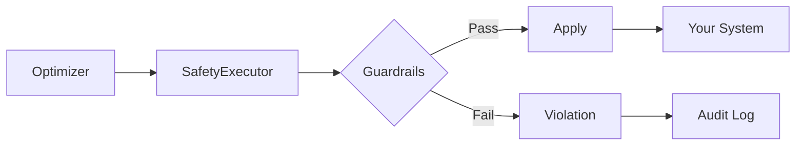

# Safety & Guardrails

ArqonHPO's Safety Layer enforces governance on every parameter update, preventing runaway configurations and enabling rollback.

---

## Why Safety Matters

Optimization without guardrails is dangerous:

- **Config oscillation**: Parameters swing wildly between updates
- **Catastrophic settings**: One bad config crashes your system
- **Audit gaps**: No record of what changed when

ArqonHPO treats safety as a first-class concern.

---

## The Safety Executor

The `SafetyExecutor` sits between the optimizer and your system:



Every update passes through:
1. **Bounds check** — Parameters within allowed range?
2. **Delta check** — Change magnitude acceptable?
3. **Rate limit** — Not updating too frequently?
4. **Control safety** — Not in safe mode?

---

## Guardrails Configuration

### Bounds
Absolute limits on parameter values:

```json
{
  "bounds": [[0.0, 1.0], [0.0, 100.0]]
}
```

### Delta Limits
Maximum change per update:

```json
{
  "max_delta": [0.1, 10.0]
}
```

Prevents wild swings even if optimizer suggests them.

### Rate Limiting
Maximum updates per second:

```json
{
  "max_updates_per_second": 10.0
}
```

Prevents oscillation from feedback loops.

---

## Safety Presets

ArqonHPO provides three presets:

### Conservative
```json
{
  "max_delta": [0.01, 0.01],
  "max_updates_per_second": 1.0
}
```
Slow, safe changes. For production systems.

### Balanced
```json
{
  "max_delta": [0.1, 0.1],
  "max_updates_per_second": 10.0
}
```
Reasonable pace. For staging/testing.

### Aggressive
```json
{
  "max_delta": [1.0, 1.0],
  "max_updates_per_second": 100.0
}
```
Fast exploration. For offline benchmarks only.

---

## Rollback Policy

Define when to revert to previous good state:

```json
{
  "rollback_policy": {
    "max_consecutive_regressions": 3,
    "max_rollbacks_per_hour": 5,
    "min_stable_time_us": 60000000
  }
}
```

| Field | Description |
|-------|-------------|
| `max_consecutive_regressions` | Roll back after N worse results |
| `max_rollbacks_per_hour` | Circuit breaker for rollback loops |
| `min_stable_time_us` | Must be stable for N μs before new updates |

---

## Violations

When a guardrail is triggered:

| Violation | Cause | Action |
|-----------|-------|--------|
| `BoundsExceeded` | Param outside range | Clamp to bounds |
| `DeltaTooLarge` | Change too big | Reject update |
| `RateLimitExceeded` | Too many updates | Defer update |
| `SafeModeActive` | System in safe mode | Reject all updates |

All violations are logged to the audit trail.

---

## Safe Mode

When triggered, **Safe Mode** freezes all updates:

### Triggers
- Manual activation
- Too many consecutive regressions
- External signal (e.g., monitoring alert)

### Exit Conditions
- Manual deactivation
- Stable for `min_stable_time_us`
- Reset command

```rust
// In Rust
executor.enter_safe_mode(SafeModeReason::ManualActivation);
executor.exit_safe_mode();
```

---

## Audit Trail

Every action is logged:

```json
{
  "ts": 1704067200,
  "event": "apply",
  "proposal": [0.5, 0.3],
  "result": "success",
  "new_gen": 42
}
```

```json
{
  "ts": 1704067201,
  "event": "violation",
  "type": "DeltaTooLarge",
  "proposed": [0.9, 0.1],
  "limit": [0.1, 0.1]
}
```

Access via:
- Dashboard API: `GET /api/events`
- CLI: `arqonhpo export --state state.json`

---

## Best Practices

1. **Start conservative** — Tighten limits initially
2. **Monitor violations** — High violation rate = bad optimizer config
3. **Set rollback policy** — Automatic recovery is essential
4. **Enable audit logging** — Always, even in production
5. **Test safe mode** — Verify your system handles frozen params

---

## Next Steps

- [Strategies](strategies.md) — Optimizer algorithms
- [Observability](../reference/observability.md) — Metrics and monitoring
- [Dashboard](../reference/dashboard.md) — Web UI for monitoring
