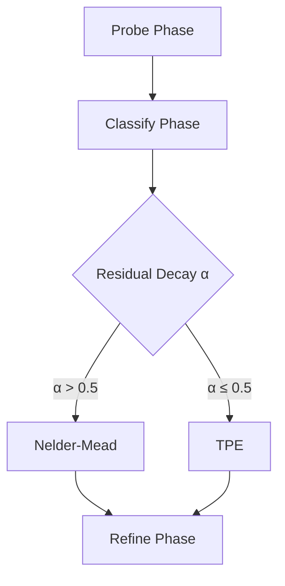

# Optimization Strategies

**Different landscapes require different navigators.**

A smooth, convex valley is best descended by a geometric solver. A noisy, chaotic mountain range requires a probabilistic explorer. ArqonHPO does not force you to choose one or the other—it chooses for you, dynamically.

The **PCR (Probe-Classify-Refine)** algorithm continuously analyzes the topology of your objective function. It calculates the fractal dimension of the response surface and automatically hot-swaps the underlying strategy to match the terrain. This allows ArqonHPO to transition seamlessly from global exploration to local polishing without human intervention.

---

## Strategy Overview

| Strategy        | Best For                     | Characteristics                                    |
| --------------- | ---------------------------- | -------------------------------------------------- |
| **Nelder-Mead** | Smooth, unimodal functions   | Fast convergence, low overhead, requires structure |
| **TPE**         | Noisy, expensive evaluations | Robust to noise, handles multimodal landscapes     |

---

## Nelder-Mead Simplex

The **Nelder-Mead** algorithm is a derivative-free optimizer that maintains a simplex of N+1 points in N dimensions.

### Algorithm Overview

Nelder-Mead iteratively transforms a simplex (a geometric shape with N+1 vertices in N dimensions) to find the minimum. The algorithm uses four operations:

1. **Reflection**: Move the worst point through the centroid of the remaining points
2. **Expansion**: If reflection finds a good point, extend further in that direction
3. **Contraction**: If reflection fails, pull the worst point toward the centroid
4. **Shrink**: If contraction fails, shrink the entire simplex toward the best point

Each iteration replaces the worst point with a better one, gradually moving the simplex toward the optimum.

### Default Coefficients

ArqonHPO uses standard Nelder-Mead coefficients (verified from `nelder_mead.rs`):

| Coefficient | Value | Purpose                 |
| ----------- | ----- | ----------------------- |
| `alpha` (α) | 1.0   | Reflection coefficient  |
| `gamma` (γ) | 2.0   | Expansion coefficient   |
| `rho` (ρ)   | 0.5   | Contraction coefficient |
| `sigma` (σ) | 0.5   | Shrink coefficient      |

### Convergence Criteria

The algorithm considers itself converged when the simplex diameter falls below a tolerance threshold—indicating that all points have collapsed to essentially the same location.

### When Nelder-Mead Works Well

- ✅ Smooth, continuous objective functions
- ✅ Unimodal landscapes (single minimum)
- ✅ Continuous parameters
- ✅ Low to moderate dimensionality
- ✅ Deterministic evaluations (no noise)

### When Nelder-Mead Struggles

- ❌ Noisy evaluations (can get confused by measurement noise)
- ❌ Multimodal landscapes (may converge to local minima)
- ❌ High-dimensional spaces (simplex becomes inefficient)
- ❌ Discontinuous or non-smooth functions

### Warm-Starting from Probe

When PCR classifies a problem as "Structured," Nelder-Mead is initialized using the best points from the Probe phase. This creates an initial simplex centered on promising regions rather than starting blindly.

---

## Tree-structured Parzen Estimator (TPE)

**TPE** is a Bayesian optimization algorithm that models the relationship between parameters and objective values probabilistically.

### Algorithm Overview

Unlike traditional Bayesian optimization that models P(y|x), TPE models P(x|y)—the probability of parameters given "good" or "bad" outcomes.

1. **Split observations**: Divide all evaluated points into "good" (below a threshold) and "bad" (above threshold) groups based on objective values
2. **Fit density estimators**: Build kernel density estimates (KDEs) for both groups
3. **Sample candidates**: Draw samples that maximize the ratio l(x)/g(x), where l(x) is the "good" density and g(x) is the "bad" density
4. **Evaluate and update**: Evaluate the best candidates and add results to history

### Bandwidth Selection

TPE uses kernel density estimation, which requires choosing an appropriate bandwidth (smoothing parameter). ArqonHPO supports multiple bandwidth rules (verified from `tpe.rs`):

| Rule                       | Formula                                    | Use Case                                |
| -------------------------- | ------------------------------------------ | --------------------------------------- |
| **Scott's Rule** (default) | σ = 1.06 × stddev × n^(-1/5)               | Standard choice, adapts to distribution |
| **Silverman's Rule**       | σ = 0.9 × min(stddev, IQR/1.34) × n^(-1/5) | More robust to outliers                 |
| **Fixed**                  | Percentage of range                        | Legacy behavior                         |

### When TPE Works Well

- ✅ Noisy objective functions (measurement noise, stochastic training)
- ✅ Expensive evaluations (makes efficient use of samples)
- ✅ Multimodal landscapes (explores multiple regions)
- ✅ Mixed or categorical parameters (handles discrete choices)

### When TPE Is Less Efficient

- ⚠️ Higher per-candidate computational overhead
- ⚠️ Slower convergence on smooth, well-behaved functions
- ⚠️ Small sample sizes (needs sufficient data to build good density models)

### Online Optimization

TPE is the strategy used by `ask_one()` for online/real-time optimization. Its incremental nature makes it well-suited for streaming scenarios where evaluations arrive one at a time.

---

## Automatic Strategy Selection

ArqonHPO's PCR algorithm automatically selects the appropriate strategy based on landscape analysis:

### Classification Logic

The ResidualDecayClassifier examines how objective values improve across the probe samples. Functions with exploitable structure show geometric decay in residuals, while noisy or multimodal functions show irregular patterns.

| Signal         | Interpretation              | Strategy    |
| -------------- | --------------------------- | ----------- |
| High α (> 0.5) | Geometric residual decay    | Nelder-Mead |
| Low α (≤ 0.5)  | Flat or irregular residuals | TPE         |

For details on the classification algorithm, see [PCR Algorithm](pcr_algorithm.md).

---

## Multi-Start Nelder-Mead

!!! note "Not Currently Used by PCR"
Multi-Start NM is available in the codebase but is not currently selected by the PCR classifier. It remains available for potential future use or manual configuration.

For **multimodal** functions with multiple local minima, Multi-Start NM launches several simplex searches from different starting points.

### How It Works

1. **Probe** phase samples the landscape
2. **Identify** multiple promising regions
3. **Launch** independent NM searches per region
4. **Return** the best result across all runs

This approach is more expensive than single NM but can escape local minima.

---

## Strategy Comparison

| Aspect                                    | Nelder-Mead                    | TPE                            |
| ----------------------------------------- | ------------------------------ | ------------------------------ |
| **Mechanism**                             | Geometric simplex operations   | Probabilistic density modeling |
| **Per-step overhead**                     | Minimal                        | Higher (density estimation)    |
| **Sample efficiency on smooth functions** | Excellent                      | Good                           |
| **Noise tolerance**                       | Poor                           | Excellent                      |
| **Incremental/online use**                | Difficult (needs full simplex) | Natural fit                    |
| **Warm-start support**                    | Yes (from probe points)        | Yes (from all history)         |

---

## Next Steps

- :mag: **[PCR Algorithm](pcr_algorithm.md)**

  How Probe-Classify-Refine works

- :zap: **[Batch vs. Online](batch_vs_online.md)**

  When to use `ask()` vs. `ask_one()`

- :dart: **[Probe Deep Dive](probe_deep_dive.md)**

  Mathematics of the sampling phase

---
