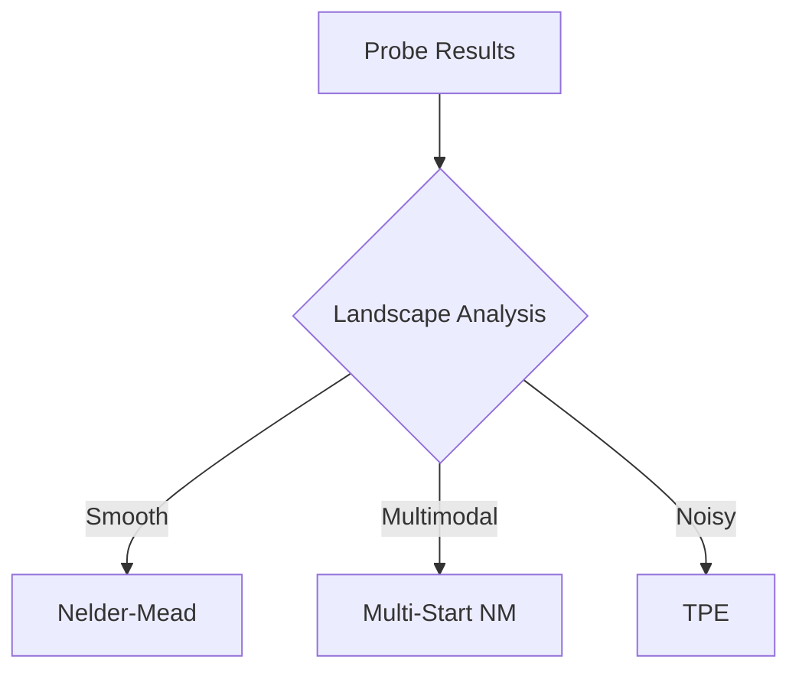

# Optimization Strategies

ArqonHPO uses different strategies depending on the problem characteristics. This page explains each strategy and when it's selected.

---

## Strategy Overview

| Strategy | Best For | Speed | Sample Efficiency |
|----------|----------|-------|-------------------|
| **Nelder-Mead** | Smooth, unimodal functions | ⚡ Fast | ⭐⭐⭐ Good |
| **Multi-Start NM** | Multimodal landscapes | ⚡ Fast | ⭐⭐ Medium |
| **TPE** | Noisy, categorical params | 🐢 Slower | ⭐⭐⭐⭐ Best |

---

## Nelder-Mead Simplex

The **classic Nelder-Mead** algorithm is a derivative-free optimizer that maintains a simplex of n+1 points in n dimensions.

### How It Works

1. **Initialize** simplex around starting point
2. **Evaluate** objective at all vertices
3. **Transform** simplex via reflection, expansion, contraction
4. **Repeat** until convergence

### When To Use

- ✅ Smooth objective functions
- ✅ Continuous parameters
- ✅ Low-dimensional (< 20 params)
- ✅ Deterministic evaluations

### Configuration

```json
{
  "strategy_params": {
    "alpha": 1.0,    // Reflection coefficient
    "gamma": 2.0,    // Expansion coefficient
    "rho": 0.5,      // Contraction coefficient
    "sigma": 0.5     // Shrink coefficient
  }
}
```

---

## Multi-Start Nelder-Mead

For **multimodal** functions (multiple local minima), Multi-Start NM runs several simplex searches from different starting points.

### How It Works

1. **Probe** phase samples the landscape
2. **Cluster** promising regions
3. **Launch** independent NM searches per cluster
4. **Return** best across all runs

### When To Use

- ✅ Multiple local minima
- ✅ Large parameter ranges
- ✅ Sufficient budget (10x single NM)
- ⚠️ More expensive than single NM

### Configuration

```json
{
  "strategy_params": {
    "n_starts": 5,           // Number of parallel starts
    "restart_threshold": 0.1 // Restart if no improvement
  }
}
```

---

## Tree-structured Parzen Estimator (TPE)

**TPE** is a Bayesian optimization algorithm that models p(x|y) instead of p(y|x).

### How It Works

1. **Split** observations into good/bad groups by objective value
2. **Fit** kernel density estimators (KDE) to each group
3. **Sample** candidates that maximize l(x)/g(x) ratio
4. **Evaluate** and update model

### When To Use

- ✅ Noisy objective functions
- ✅ Expensive evaluations (>1 second)
- ✅ Categorical or mixed parameters
- ⚠️ Higher per-candidate overhead

### Configuration

```json
{
  "strategy_params": {
    "n_startup_trials": 10,  // Random trials before TPE kicks in
    "gamma": 0.25,          // Quantile for good/bad split
    "bandwidth_rule": "Scott" // "Scott", "Silverman", or "Fixed"
  }
}
```

---

## Automatic Strategy Selection

By default, ArqonHPO uses the **Classify** phase to select strategies:



### Classification Heuristics

| Signal | Interpretation |
|--------|----------------|
| Low variance in neighbors | Smooth → NM |
| Multiple distinct basins | Multimodal → MS-NM |
| High noise-to-signal ratio | Noisy → TPE |

---

## Forcing a Strategy

Override automatic selection:

```python
config = {
    "seed": 42,
    "budget": 100,
    "bounds": {...},
    "strategy": "nelder_mead"  # Force specific strategy
}
```

Valid values: `"nelder_mead"`, `"multi_start_nm"`, `"tpe"`

---

## Performance Comparison

From our benchmarks:

| Function | Nelder-Mead | Multi-Start NM | TPE |
|----------|-------------|----------------|-----|
| Sphere (smooth) | **0.001** | 0.003 | 0.012 |
| Rosenbrock | **0.05** | 0.08 | 0.15 |
| Rastrigin (multimodal) | 2.5 | **0.8** | 1.2 |
| Noisy Sphere | 0.5 | 0.4 | **0.08** |

---

## Next Steps

- [PCR Algorithm](pcr_algorithm.md) — How Probe-Classify-Refine works
- [Benchmarks](../../benchmarks/index.md) — Full performance data
