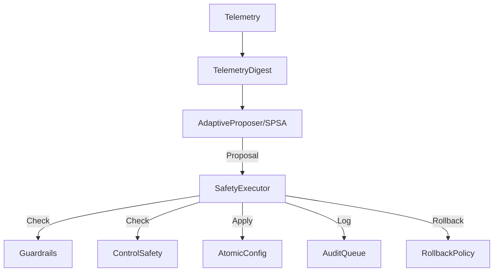
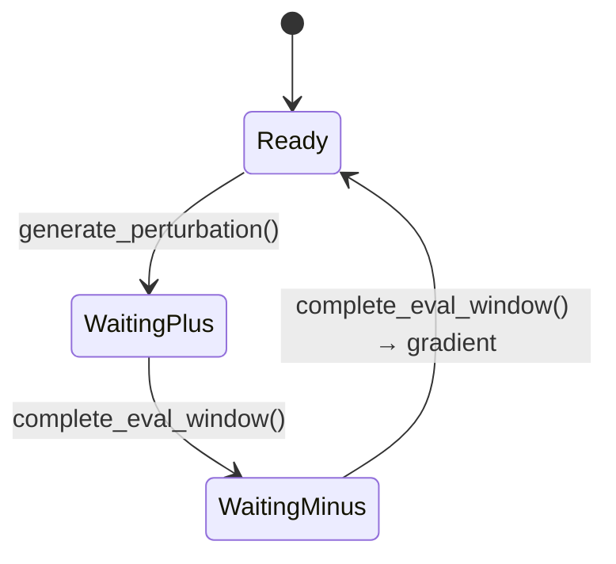

# Hotpath API Reference

The `hotpath` crate contains the **safety-critical, lock-free** components for real-time parameter updates. These are the core internals that enforce governance on every configuration change.

> [!CAUTION]
> This is low-level API. Most users should use `ArqonSolver` (Python) or `Solver` (Rust core) instead. Direct hotpath usage is for embedding ArqonHPO in control loops.

---

## Architecture Overview



---

## SafetyExecutor

**File:** `executor.rs`  
**Constitution:** II.17 — Safety Executor Contract

The `SafetyExecutor` is the **SOLE actuator** that may modify production config. Every proposal passes through guardrails before apply.

### Struct

```rust
pub struct SafetyExecutor {
    config: Arc<AtomicConfig>,
    guardrails: Guardrails,
    control_safety: ControlSafety,
    rollback_policy: RollbackPolicy,
    baseline: Option<ConfigSnapshot>,
    audit_queue: AuditQueue,
    // ... internal state
}
```

### Trait: SafeExecutor

```rust
pub trait SafeExecutor {
    /// Apply a proposal through safety guardrails.
    fn apply(&mut self, proposal: Proposal) -> Result<ApplyReceipt, Violation>;
    
    /// Rollback to baseline configuration.
    fn rollback(&mut self) -> Result<RollbackReceipt, Violation>;
    
    /// Set current config as baseline for future rollbacks.
    fn set_baseline(&mut self);
    
    /// Get current config snapshot (zero-copy).
    fn snapshot(&self) -> ConfigSnapshot;
}
```

### Usage

```rust
use hotpath::{SafetyExecutor, Guardrails, AtomicConfig, Proposal, ParamVec};
use std::sync::Arc;

let config = Arc::new(AtomicConfig::new(ParamVec::from_slice(&[0.5, 0.5])));
let mut executor = SafetyExecutor::new(config.clone(), Guardrails::default());

// Set baseline for rollback
executor.set_baseline();

// Apply a proposal
let proposal = Proposal::Update {
    iteration: 1,
    delta: ParamVec::from_slice(&[0.01, -0.01]),
    gradient_estimate: ParamVec::from_slice(&[0.1, -0.1]),
};

match executor.apply(proposal) {
    Ok(receipt) => println!("Applied, gen={}", receipt.new_generation),
    Err(violation) => println!("Rejected: {:?}", violation),
}
```

---

## Guardrails

**File:** `executor.rs`

Guardrails define the safety envelope for parameter updates.

### Struct

```rust
pub struct Guardrails {
    /// Maximum delta per parameter per step (fraction: 0.0-1.0)
    pub max_delta_per_step: f64,
    
    /// Maximum updates per second
    pub max_updates_per_second: f64,
    
    /// Minimum interval between updates (microseconds)
    pub min_interval_us: u64,
    
    /// Maximum direction flips per dimension per minute
    pub direction_flip_limit: u32,
    
    /// Cooldown after hitting flip limit (microseconds)
    pub cooldown_after_flip_us: u64,
    
    /// Maximum cumulative delta per dimension per minute
    pub max_cumulative_delta_per_minute: f64,
    
    /// Consecutive regressions before SafeMode
    pub regression_count_limit: u32,
    
    /// Per-parameter bounds: [(min, max), ...]
    pub bounds: Option<Vec<(f64, f64)>>,
}
```

### Presets

| Preset | `max_delta` | `updates/s` | `min_interval` | `flip_limit` |
|--------|-------------|-------------|----------------|--------------|
| `Conservative` | 0.05 | 2 | 500ms | 2 |
| `Balanced` (default) | 0.10 | 10 | 100ms | 3 |
| `Aggressive` | 0.20 | 20 | 50ms | 5 |

```rust
let guardrails = Guardrails::preset_conservative();
let guardrails = Guardrails::preset_balanced();
let guardrails = Guardrails::preset_aggressive();
```

---

## RollbackPolicy

**File:** `executor.rs`

Defines when to automatically revert to baseline.

### Struct

```rust
pub struct RollbackPolicy {
    /// Roll back after N consecutive worse results
    pub max_consecutive_regressions: u32,
    
    /// Circuit breaker: max rollbacks per hour
    pub max_rollbacks_per_hour: u32,
    
    /// Must be stable for N μs before new updates
    pub min_stable_time_us: u64,
}
```

### Presets

| Preset | `max_regressions` | `rollbacks/hour` | `stable_time` |
|--------|-------------------|------------------|---------------|
| `Conservative` | 2 | 2 | 30s |
| `Balanced` | 3 | 4 | 5s |
| `Aggressive` | 5 | 10 | 1s |

---

## Violation

**File:** `executor.rs`

Reasons why a proposal was rejected.

```rust
pub enum Violation {
    /// Delta exceeds max_delta_per_step
    DeltaTooLarge,
    
    /// Update rate exceeded
    RateLimitExceeded,
    
    /// Direction changed too many times
    DirectionFlipViolation,
    
    /// Cumulative change too large
    CumulativeDeltaViolation,
    
    /// System in safe mode
    InSafeMode,
    
    /// Internal: audit queue is full
    AuditQueueFull,
    
    /// No baseline set for rollback
    NoBaseline,
}
```

---

## Proposal

**File:** `proposer.rs`

The output of the adaptive proposer.

```rust
pub enum Proposal {
    /// No change needed
    NoChange { reason: NoChangeReason },
    
    /// Apply +Δ perturbation (SPSA phase 1)
    ApplyPlus { 
        perturbation_id: u64, 
        delta: ParamVec 
    },
    
    /// Apply −Δ perturbation (SPSA phase 2)
    ApplyMinus { 
        perturbation_id: u64, 
        delta: ParamVec 
    },
    
    /// Final update after SPSA gradient estimation
    Update { 
        iteration: u64, 
        delta: ParamVec, 
        gradient_estimate: ParamVec 
    },
}
```

---

## SPSA (Simultaneous Perturbation Stochastic Approximation)

**File:** `spsa.rs`  
**Constitution:** II.16 — SPSA MUST use ±1 Bernoulli perturbations, ChaCha8Rng

SPSA is the gradient-free optimizer for real-time control.

### State Machine



### SpsaState

```rust
pub enum SpsaState {
    /// Ready to start new iteration
    Ready,
    
    /// Applied +Δ, collecting objective samples
    WaitingPlus {
        perturbation_id: u64,
        delta: ParamVec,
        accumulated: Vec<f64>,
    },
    
    /// Applied −Δ, collecting objective samples  
    WaitingMinus {
        perturbation_id: u64,
        delta: ParamVec,
        y_plus: f64,
        accumulated: Vec<f64>,
    },
}
```

### SpsaConfig

```rust
pub struct SpsaConfig {
    /// Minimum digests to collect per perturbation
    pub eval_window_digests: usize,    // Default: 5
    
    /// Maximum time to wait for digests (μs)
    pub eval_window_us: u64,            // Default: 500_000
    
    /// Settle time after apply before counting (μs)
    pub settle_time_us: u64,            // Default: 10_000
    
    /// Learning rate decay exponent: a_k = a₀ / (k+1+A)^α
    pub alpha: f64,                      // Default: 0.602
    
    /// Perturbation decay exponent: c_k = c₀ / (k+1)^γ
    pub gamma: f64,                      // Default: 0.101
    
    /// Stability constant A
    pub stability_a: f64,                // Default: 10.0
}
```

### Key Methods

```rust
impl Spsa {
    /// Create new SPSA optimizer
    pub fn new(
        seed: u64,
        num_params: usize,
        learning_rate: f64,
        perturbation_scale: f64,
        config: SpsaConfig,
    ) -> Self;
    
    /// Generate ±1 Bernoulli perturbation vector
    pub fn generate_perturbation(&mut self) -> ParamVec;
    
    /// Record objective value from current window
    pub fn record_objective(&mut self, value: f64);
    
    /// Check if eval window has enough samples
    pub fn has_enough_samples(&self) -> bool;
    
    /// Complete window, compute gradient if in WaitingMinus
    pub fn complete_eval_window(&mut self) -> Option<(ParamVec, ParamVec)>;
    
    /// Current learning rate for iteration k
    pub fn learning_rate(&self, k: u64) -> f64;
    
    /// Current perturbation scale for iteration k
    pub fn perturbation_scale(&self, k: u64) -> f64;
}
```

---

## AdaptiveEngine

**File:** `orchestrator.rs`  
**Constitution:** II.16-23 — Tier 2 Adaptive Engine

The high-level orchestrator combining SPSA, Proposer, and Executor.

### Struct

```rust
pub struct AdaptiveEngine {
    proposer: SpsaProposer,
    config: Arc<AtomicConfig>,
    executor: SafetyExecutor,
}
```

### AdaptiveEngineConfig

```rust
pub struct AdaptiveEngineConfig {
    pub spsa: SpsaConfig,
    pub guardrails: Guardrails,
    pub seed: u64,
    pub learning_rate: f64,
    pub perturbation_scale: f64,
}
```

### Usage

```rust
use hotpath::{AdaptiveEngine, AdaptiveEngineConfig, ParamVec, TelemetryDigest};

let config = AdaptiveEngineConfig::default();
let initial_params = ParamVec::from_slice(&[0.5, 0.5]);
let mut engine = AdaptiveEngine::new(config, initial_params);

// Control loop
loop {
    let digest = TelemetryDigest::new(latency_us, objective, sample_count);
    
    match engine.observe(digest) {
        Ok(Proposal::Update { delta, .. }) => {
            engine.apply(Proposal::Update { ... })?;
        }
        Ok(Proposal::NoChange { .. }) => continue,
        Err(e) => eprintln!("Error: {:?}", e),
    }
}
```

---

## TelemetryDigest

**File:** `telemetry.rs`

Compressed telemetry snapshot passed to proposer.

```rust
pub struct TelemetryDigest {
    pub window_us: u64,        // Observation window duration
    pub objective_value: f64,  // Mean objective in window
    pub sample_count: u64,     // Number of samples
}

impl TelemetryDigest {
    pub fn new(window_us: u64, objective_value: f64, sample_count: u64) -> Self;
}
```

---

## AtomicConfig

**File:** `config_atomic.rs`

Lock-free, atomically swappable configuration.

```rust
pub struct AtomicConfig {
    // Uses Arc swap for lock-free reads
}

impl AtomicConfig {
    pub fn new(initial: ParamVec) -> Self;
    pub fn snapshot(&self) -> Arc<ConfigSnapshot>;
    pub fn update(&self, new_params: ParamVec) -> u64;  // Returns new generation
}

pub struct ConfigSnapshot {
    pub generation: u64,
    pub params: ParamVec,
}
```

---

## AuditQueue

**File:** `audit.rs`

Lock-free queue for audit events.

```rust
pub struct AuditQueue {
    // Bounded, lock-free queue using crossbeam
}

impl AuditQueue {
    pub fn new(capacity: usize) -> Self;
    pub fn enqueue(&self, event: AuditEvent) -> EnqueueResult;
    pub fn try_dequeue(&self) -> Option<AuditEvent>;
}

pub struct AuditEvent {
    pub timestamp_us: u64,
    pub event_type: EventType,
    pub generation: u64,
    pub details: String,
}
```

---

## Performance Characteristics

| Operation | Latency | Lock-free |
|-----------|---------|-----------|
| `snapshot()` | O(1) | ✅ |
| `apply()` | ~100μs | ⚠️ CAS loop |
| `enqueue()` | O(1) | ✅ |
| `generate_perturbation()` | O(n_params) | ✅ |

---

## Next Steps

- [Safety Concepts](../concepts/safety.md) — High-level safety patterns
- [Strategies](../concepts/strategies.md) — PCR optimizer strategies
- [Rust Core API](rust.md) — High-level Solver API
