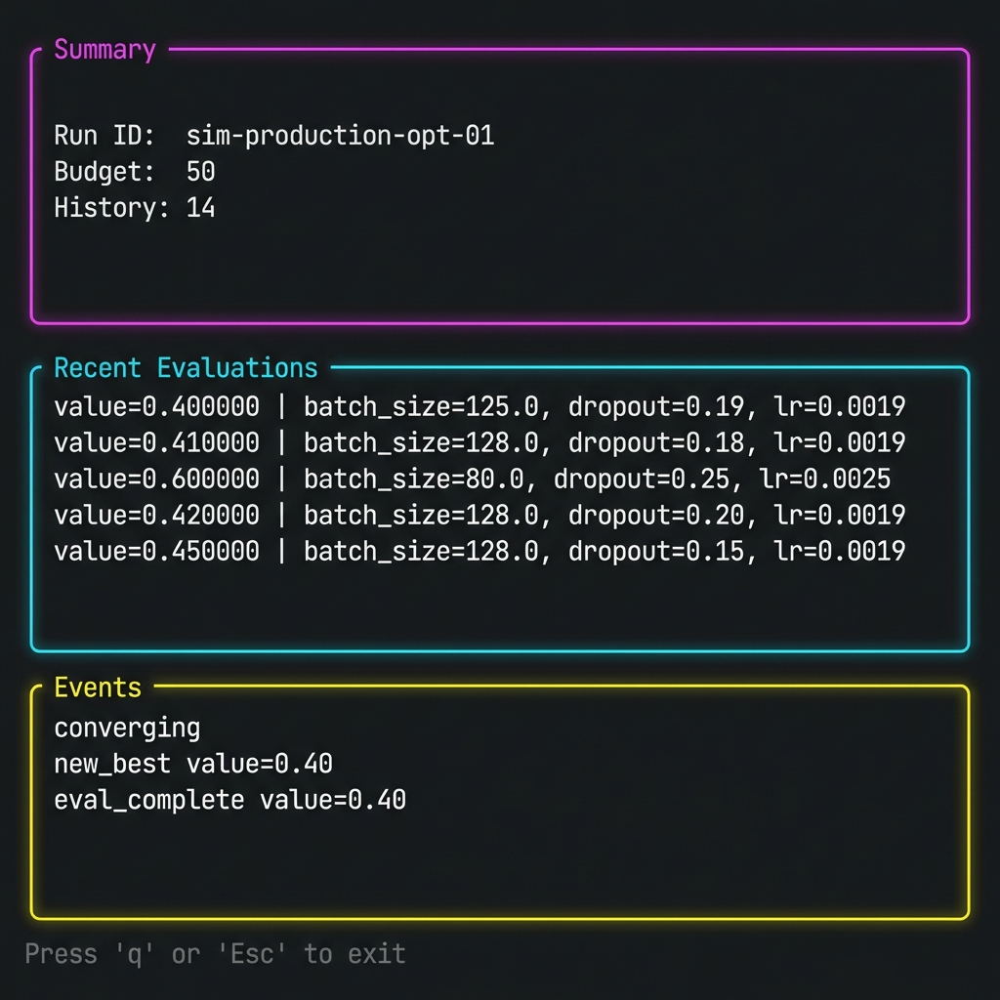

# TUI Reference

The ArqonHPO TUI (Terminal User Interface) provides real-time monitoring of solver state and events.



---

## Starting the TUI

```bash
arqonhpo tui --state state.json
```

### Options

| Flag | Default | Description |
|------|---------|-------------|
| `--state` | (required) | Path to solver state file |
| `--events` | (optional) | Path to events log file |
| `--refresh-ms` | `500` | Refresh rate in milliseconds |

---

## Interface Layout

```
┌─────────────────────────────────────────────────────────────────┐
│                    ArqonHPO TUI v0.3.0                         │
├─────────────────────────────────────────────────────────────────┤
│  Status: Running │ Budget: 45/100 │ Best: 0.0234              │
├─────────────────────────────────────────────────────────────────┤
│  Current Best Parameters                                        │
│  ┌───────────┬──────────┐                                      │
│  │ Parameter │ Value    │                                      │
│  ├───────────┼──────────┤                                      │
│  │ x         │ 1.9823   │                                      │
│  │ y         │ -0.9945  │                                      │
│  └───────────┴──────────┘                                      │
├─────────────────────────────────────────────────────────────────┤
│  Event Log                                                      │
│  [12:34:56] ask: batch_size=4                                  │
│  [12:34:57] tell: best_improved 0.0512 → 0.0234               │
│  [12:34:58] phase: Refine (Nelder-Mead)                        │
└─────────────────────────────────────────────────────────────────┘
│  [q] Quit  [r] Refresh  [p] Pause                              │
└─────────────────────────────────────────────────────────────────┘
```

---

## Keybindings

| Key | Action |
|-----|--------|
| `q` | Quit the TUI |
| `r` | Force refresh |
| `p` | Pause/resume auto-refresh |
| `↑` / `↓` | Scroll event log |
| `Ctrl+C` | Force quit |

---

## Event Log Format

Events are displayed in the format:
```
[HH:MM:SS] event_type: details
```

### Event Types

| Event | Description |
|-------|-------------|
| `ask` | Solver returned candidates |
| `tell` | Results reported to solver |
| `phase` | Solver phase transition (Probe → Classify → Refine) |
| `best_improved` | New best value found |
| `strategy` | Strategy selection changed |
| `warning` | Guardrail triggered |
| `error` | Error occurred |

---

## State File

The TUI reads from the state file specified by `--state`. This file is updated by `arqonhpo ask/tell` commands.

**State Schema:**
```json
{
  "config": { ... },
  "history": [ ... ],
  "phase": "Refine",
  "best": {
    "params": {"x": 1.98, "y": -0.99},
    "value": 0.0234
  }
}
```

---

## Events File (Optional)

If `--events` is specified, the TUI tails this file for real-time events:

```bash
arqonhpo tui --state state.json --events events.jsonl
```

Events file format (JSONL):
```json
{"ts": 1704067200, "type": "ask", "batch": 4}
{"ts": 1704067201, "type": "tell", "results": [...]}
```

---

## Configuration

### Refresh Rate

Lower refresh rates reduce CPU usage but make the display less responsive:

```bash
# Faster updates (100ms)
arqonhpo tui --state state.json --refresh-ms 100

# Slower updates (2 seconds)
arqonhpo tui --state state.json --refresh-ms 2000
```

---

## Next Steps

- [CLI Reference](cli.md) — Full CLI documentation
- [Dashboard](dashboard.md) — Web-based monitoring
