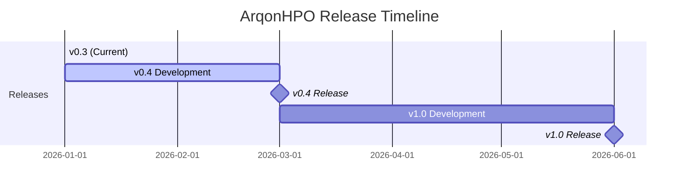

# Roadmap

ArqonHPO follows semantic versioning. This document outlines our vision, planned features, and development priorities.

---

## Current: v0.3.x (Stable)

**Status:** ✅ Released (January 2026)

The production-ready foundation for real-time hyperparameter optimization.

### Core Capabilities

- **PCR Algorithm** — The Probe-Classify-Refine pipeline automatically selects strategies based on landscape structure
- **Python Bindings** — `ArqonSolver` for batch optimization, `ArqonProbe` for distributed LDS sampling
- **CLI & Observability** — TUI, web Dashboard, Prometheus metrics, structured logging
- **Safety Executor** — Constitutional guarantees with Guardrails, Rollback Policy, and audit trail
- **91% Test Coverage** — Comprehensive unit and integration tests

### What Makes v0.3 Production-Ready

| Requirement             | Status                    |
| ----------------------- | ------------------------- |
| Deterministic execution | ✅ ChaCha8Rng             |
| Bounded memory          | ✅ Ring buffers           |
| Recoverable state       | ✅ Snapshot + rollback    |
| Observable              | ✅ Metrics, traces, audit |
| Documented              | ✅ 50+ pages              |

---

## Next: v0.4.0 (Q1 2026)

**Status:** 🔨 In Development

The **"Infrastructure Phase"** — making ArqonHPO deployable anywhere with comprehensive observability.

### New Features

#### Adaptive Nelder-Mead with Restart Detection

The current Nelder-Mead implementation can stall when the simplex degenerates. v0.4 adds automatic restart detection:

```rust
// Detects when simplex volume collapses below threshold
// Automatically reinitializes with exploration phase
let nm = NelderMead::with_restart(config, restart_threshold);
```

- **Problem:** Simplex can collapse to a line in high dimensions
- **Solution:** Monitor simplex volume, trigger restart when degenerate
- **Benefit:** More robust convergence on ill-conditioned surfaces

#### Multi-Objective Optimization (MOO)

Support for Pareto-front optimization with multiple objectives:

```python
config = {
    "objectives": ["latency", "throughput"],  # Both minimize
    "mode": "pareto"
}
solver = ArqonSolver(json.dumps(config))
candidates = solver.ask()  # Returns Pareto-optimal candidates
```

- **Algorithm:** NSGA-II style dominance sorting
- **Output:** Pareto front with configurable size
- **Trade-off:** User selects from Pareto set

#### ArqonShip v1.0 (Self-Healing CI)

The ArqonShip integration reaches v1.0 with:

- Automatic rollback on CI failure
- Bisection to find breaking commits
- Artifact correlation with test results
- Slack/Discord notifications

### Infrastructure

#### Docker Images

Official multi-platform images:

```bash
docker pull ghcr.io/novelbytelabs/arqonhpo:0.4
docker pull ghcr.io/novelbytelabs/arqonhpo:0.4-slim  # ~20MB
```

Platforms: `linux/amd64`, `linux/arm64`, `darwin/arm64`

#### Helm Chart

Production Kubernetes deployment:

```bash
helm repo add arqon https://novelbytelabs.github.io/charts
helm install arqon arqon/arqonhpo \
  --set config.budget=1000 \
  --set monitoring.enabled=true
```

Includes: ServiceMonitor, PodDisruptionBudget, HPA

#### OpenTelemetry Integration

Full OTel support for distributed tracing:

```bash
arqonhpo --otel-endpoint http://otel-collector:4317 run ...
```

- **Traces:** ask/tell spans with parameter context
- **Metrics:** OTel metrics alongside Prometheus
- **Logs:** Structured logs with trace correlation

---

## Future: v1.0.0 (Q2 2026)

**Status:** 🎯 Planned

The **"Scale Phase"** — GPU acceleration and distributed optimization for massive parameter spaces.

### GPU-Accelerated Strategies

#### CUDA Backend

TPE kernel density estimation on GPU:

```rust
let tpe = TPE::cuda(device_id, dim);
// 100x speedup for high-dimensional KDE
```

- **Speedup:** 100x for dim > 100
- **Memory:** Configurable batch size
- **Fallback:** Graceful CPU fallback

#### Metal Backend (Apple Silicon)

Native M1/M2/M3 support via Metal:

```python
solver = ArqonSolver(config, device="metal")
```

### Distributed Optimization

#### Sharded Workers

Horizontal scaling across nodes:

```yaml
# arqon-distributed.yaml
mode: distributed
coordinator:
  address: arqon-coordinator:9090
workers:
  count: 16
  strategy: round_robin
sharding:
  probe: by_index # ArqonProbe sharding
  refine: by_region # Spatial partitioning
```

- **Coordinator:** Central state, Raft consensus
- **Workers:** Stateless evaluators
- **Communication:** gRPC with protobuf

#### Fault Tolerance

Automatic recovery from worker failures:

- Checkpoint every N evaluations
- Replay from last checkpoint
- Worker health checks with timeout

### Full Bayesian TPE

The current TPE uses point estimates. v1.0 adds full Bayesian treatment:

```rust
let tpe = TPE::bayesian(prior, acquisition_fn);
```

- **Prior:** Configurable Gaussian or Student-t
- **Acquisition:** EI, PI, UCB, Thompson Sampling
- **Uncertainty:** Credible intervals on predictions

### Ecosystem Integrations

| Integration | Status  | Description       |
| ----------- | ------- | ----------------- |
| Ray Tune    | ✅ v0.3 | Custom searcher   |
| MLflow      | ✅ v0.3 | Tracking plugin   |
| W&B         | 🎯 v1.0 | Callback + sweeps |
| Optuna      | 🎯 v1.0 | Sampler adapter   |
| Ax          | 🎯 v1.0 | Backend provider  |

---

## Long-Term Vision (v2.0+)

### ArqonHPO as Infrastructure

Our north star: **Optimization should be as reliable as a database.**

| Database Property      | ArqonHPO Equivalent      |
| ---------------------- | ------------------------ |
| ACID transactions      | Atomic config updates    |
| Point-in-time recovery | Snapshot rollback        |
| Replication            | Distributed coordinators |
| Query optimization     | Auto-strategy selection  |

### Zero-Configuration Optimization

Fully automatic strategy selection:

```python
# v2.0 vision: just specify the objective
solver = ArqonSolver.auto(budget=100)
# ArqonHPO infers bounds, selects strategy, tunes hyperparams
```

### Sub-Microsecond Overhead

Target: **<1μs** latency for `ask()` in hot path:

| Version | ask() Latency |
| ------- | ------------- |
| v0.3    | ~3ms          |
| v0.4    | ~500μs        |
| v1.0    | ~100μs        |
| v2.0    | <1μs          |

### Constitutional AI Safety

Extending constitutional safety to AI-in-the-loop:

```yaml
constitution:
  max_regression_before_human: 3
  human_approval_required_for:
    - production_deploy
    - safety_override
  audit_retention: 90d
```

---

## What We're NOT Building (Anti-Roadmap)

Clarity on scope:

| Feature                    | Why Not                     |
| -------------------------- | --------------------------- |
| Neural Architecture Search | Out of scope — use ArqonNAS |
| AutoML end-to-end          | Arqon AutoGrokML            |
| GUI configuration          | CLI/API-first design        |
| Cloud-hosted service       | Self-hosted only (for now)  |

---

## Feature Requests & Voting

We prioritize based on community feedback:

1. **GitHub Discussions** — [Propose new features](https://github.com/novelbytelabs/ArqonHPO/discussions/categories/ideas)
2. **Vote on existing** — 👍 reaction on issues
3. **Contribute** — PRs welcome for roadmap items

---

## Version Comparison

| Feature          | v0.3 | v0.4 | v1.0 |
| ---------------- | ---- | ---- | ---- |
| PCR Algorithm    | ✅   | ✅   | ✅   |
| Safety Executor  | ✅   | ✅   | ✅   |
| Python Bindings  | ✅   | ✅   | ✅   |
| Docker Images    | ❌   | ✅   | ✅   |
| Helm Chart       | ❌   | ✅   | ✅   |
| OpenTelemetry    | ❌   | ✅   | ✅   |
| Multi-Objective  | ❌   | ✅   | ✅   |
| GPU Acceleration | ❌   | ❌   | ✅   |
| Distributed      | ❌   | ❌   | ✅   |
| Bayesian TPE     | ❌   | ❌   | ✅   |

---

## Release Timeline



---

## Next Steps

- [Changelog](changelog.md) — Detailed version history
- [Contributing](CONTRIBUTING.md) — How to help
- [About](about.md) — Our philosophy
