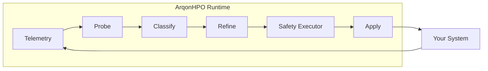
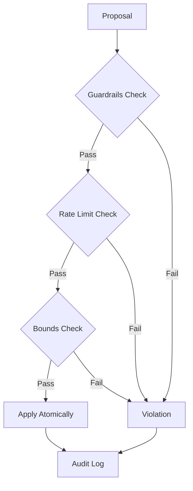

# Architecture

ArqonHPO is built as a **control primitive**, not a search algorithm. This page explains how the pieces fit together.

---

## System Overview



---

## The PCR Loop

ArqonHPO uses a **Probe → Classify → Refine** architecture:

### 1. Probe (Tier 0)

**Goal:** Efficiently scan the parameter landscape.

- Uses **Low-Discrepancy Sequences** (LDS) for uniform coverage
- Prime-sqrt-slopes rotation for high-dimensional spaces
- Stateless, deterministic, shardable via `ArqonProbe`

### 2. Classify (Tier Ω)

**Goal:** Detect whether the landscape is structured or chaotic.

- Analyzes probe results for patterns
- Determines optimal strategy for refinement
- Detects: smooth gradients vs. noisy/multimodal surfaces

### 3. Refine (Tier 2)

**Goal:** Converge to optimal parameters.

Strategies:

- **Nelder-Mead** — Simplex method for smooth functions
- **Multi-Start Nelder-Mead** — Parallel restarts for multimodal
- **TPE** — Bayesian optimization for noisy landscapes

---

## Safety Layer (Hotpath)

The **Safety Executor** enforces governance on every parameter update:



### Key Components

| Component        | Responsibility                               |
| ---------------- | -------------------------------------------- |
| `SafetyExecutor` | Enforces all safety rules                    |
| `Guardrails`     | Configures bounds, rate limits, delta limits |
| `RollbackPolicy` | Defines when to revert changes               |
| `ControlSafety`  | Implements safe mode and exemptions          |
| `AuditQueue`     | Lock-free event logging                      |

---

## Crate Structure

```
crates/
├── core/           # Solver, Probe, Classify, Strategies
│   └── strategies/ # Nelder-Mead, Multi-Start NM, TPE
├── hotpath/        # Safety Executor, SPSA, Telemetry, Audit
├── cli/            # CLI, TUI, Dashboard
├── ffi/            # C FFI bindings
└── ship/           # ArqonShip DevSecOps tool

bindings/
└── python/         # PyO3 bindings (ArqonSolver, ArqonProbe)
```

---

## Data Flow

1. **User** calls `ask()` → Solver returns candidate parameters
2. **User** evaluates candidates → calls `tell()` with results
3. **Solver** updates internal state, refines strategy
4. **Repeat** until budget exhausted

For **online mode**, use `ask_one()` + `seed()` for single-candidate flow.

---

## Performance Characteristics

| Metric             | Value                 |
| ------------------ | --------------------- |
| Overhead per trial | ~3ms                  |
| Throughput         | ~33,000 trials/sec    |
| Memory             | O(history_size)       |
| Deterministic      | Yes (with fixed seed) |

---

## Next Steps

- [Quickstart](../documentation/quickstart.md) — Get running in 5 minutes
- [Safety Deep Dive](../documentation/concepts/safety.md) — Guardrails and rollback
- [Strategies](../documentation/concepts/strategies.md) — When to use each
