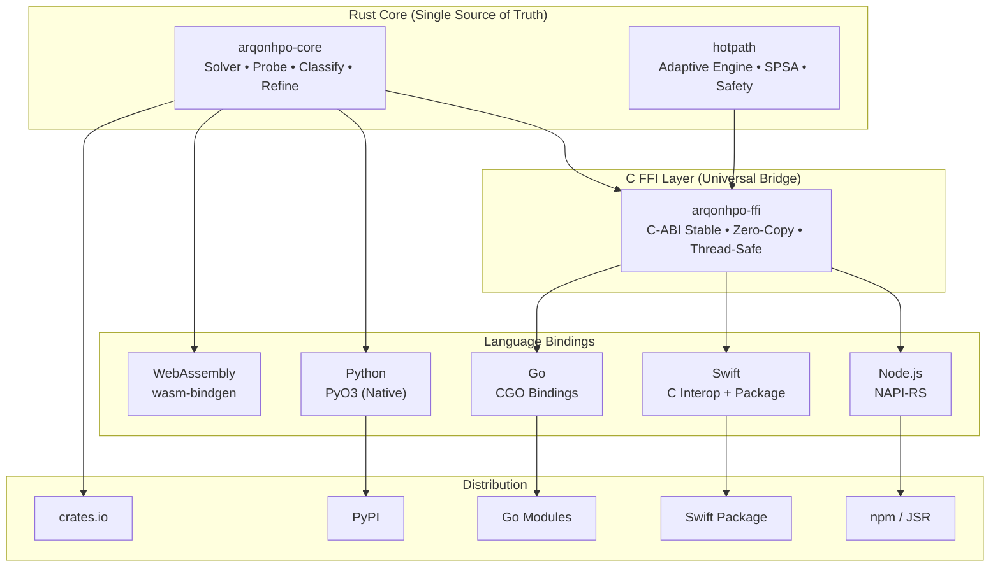

# ArqonHPO Cross-Platform SDK - Implementation Plan

> **Status:** Deferred - Documentation and website work prioritized first.
> **Created:** 2025-12-17
> **Last Updated:** 2025-12-17

## Executive Summary

Transform ArqonHPO from a Python-only library into a **world-class, truly cross-platform SDK** that runs everywhere: from edge devices to browsers, from mobile apps to cloud-native services.

### Vision: The Universal Optimization Primitive

ArqonHPO's sub-microsecond performance isn't just fast—it's **fast enough to embed anywhere**. This SDK strategy leverages that speed advantage to create optimization primitives for every platform.

---

## Decision Points (To Be Resolved)

> [!IMPORTANT]
> **Target Platform Prioritization**: Confirm the priority order for language bindings:
>
> 1. **Node.js/TypeScript** - NPM ecosystem, edge computing (Cloudflare Workers, Deno)
> 2. **Swift/iOS** - Apple platforms, on-device ML tuning
> 3. **Go** - Cloud infrastructure, Kubernetes operators
> 4. **WebAssembly** - Browser-based optimization, portable edge

> [!WARNING]  
> **Breaking Change Consideration**: The current Python SDK uses JSON-serialized configs. Options:
>
> - **Option A**: Keep JSON for all SDKs (maximum portability, simpler FFI)
> - **Option B**: Native typed configs per language (better ergonomics, more implementation work)
> - **Option C**: Both (JSON for interop, native wrappers for convenience)

---

## Architecture Overview



---

## Proposed Changes

### Component 1: Enhanced C FFI Layer

The C FFI is the universal substrate enabling all non-Rust bindings. Must be rock-solid.

---

#### [MODIFY] `crates/ffi/src/lib.rs`

Complete rewrite from placeholder to production-ready C FFI.

**Key Design Principles:**

- **Opaque Handles**: All Rust objects exposed as opaque pointers (`*mut ArqonSolver`)
- **Error Strings**: Errors returned as allocated C strings (caller must free)
- **JSON In/Out**: Config and results as C strings for maximum portability
- **Thread Safety**: All exported functions are thread-safe

```rust
// === Core Types (C-compatible) ===

/// Opaque solver handle
#[repr(C)]
pub struct ArqonSolverHandle {
    _private: [u8; 0],
}

/// Opaque probe handle
#[repr(C)]
pub struct ArqonProbeHandle {
    _private: [u8; 0],
}

/// Result type for fallible operations
#[repr(C)]
pub struct ArqonResult {
    success: bool,
    error_message: *mut c_char,  // NULL on success, caller must free on error
}

/// Batch output from ask()
#[repr(C)]
pub struct ArqonBatch {
    json_data: *mut c_char,  // JSON array of candidates, caller must free
    count: usize,            // Number of candidates (0 = optimization complete)
}

// === Lifecycle Functions ===

/// Create a new solver from JSON config
/// Returns NULL on error, sets error via arqon_last_error()
#[no_mangle]
pub extern "C" fn arqon_solver_create(config_json: *const c_char) -> *mut ArqonSolverHandle;

/// Destroy a solver and free all resources
#[no_mangle]
pub extern "C" fn arqon_solver_destroy(solver: *mut ArqonSolverHandle);

// === Core API ===

/// Get next batch of candidates
/// Returns empty batch (count=0) when optimization is complete
#[no_mangle]
pub extern "C" fn arqon_solver_ask(solver: *mut ArqonSolverHandle) -> ArqonBatch;

/// Report evaluation results
#[no_mangle]
pub extern "C" fn arqon_solver_tell(
    solver: *mut ArqonSolverHandle,
    results_json: *const c_char
) -> ArqonResult;

// === Memory Management ===

/// Free a string allocated by this library
#[no_mangle]
pub extern "C" fn arqon_string_free(s: *mut c_char);

/// Get the last error message (thread-local)
#[no_mangle]
pub extern "C" fn arqon_last_error() -> *const c_char;
```

---

#### [NEW] `crates/ffi/Cargo.toml`

Enhanced Cargo.toml with proper library types and documentation.

```toml
[package]
name = "arqonhpo-ffi"
version = "0.1.0"
edition = "2021"
description = "C FFI bindings for ArqonHPO - Cross-platform optimization SDK"
license = "Apache-2.0"
categories = ["api-bindings", "development-tools::ffi"]

[lib]
name = "arqonhpo"
crate-type = ["cdylib", "staticlib"]

[dependencies]
arqonhpo-core = { workspace = true }
libc = "0.2"
serde_json = { workspace = true }

[build-dependencies]
cbindgen = "0.27"

[features]
default = []
# Include Adaptive Engine APIs in FFI
adaptive-engine = []
```

---

#### [NEW] `crates/ffi/cbindgen.toml`

Automatic C header generation for downstream bindings.

```toml
language = "C"
header = "/* ArqonHPO - Cross-Platform Optimization SDK */"
include_guard = "ARQONHPO_H"
tab_width = 4
style = "Both"
cpp_compat = true

[export]
prefix = "Arqon"

[defines]
"feature = adaptive-engine" = "ARQONHPO_ADAPTIVE_ENGINE"
```

---

### Component 2: Node.js / TypeScript Bindings

Using NAPI-RS for native Node.js bindings with full TypeScript support.

---

#### [NEW] `bindings/node/`

Complete Node.js/TypeScript SDK package.

**Directory Structure:**

```
bindings/node/
├── Cargo.toml           # NAPI-RS Rust bindings
├── src/
│   └── lib.rs           # NAPI wrappers
├── package.json         # NPM package config
├── index.d.ts           # TypeScript declarations
├── index.js             # ESM exports
└── npm/                 # Pre-built binaries per platform
    ├── darwin-arm64/
    ├── darwin-x64/
    ├── linux-arm64/
    ├── linux-x64/
    └── win32-x64/
```

**TypeScript API Design (index.d.ts):**

````typescript
/**
 * ArqonHPO - Adaptive Hyperparameter Optimization
 *
 * @example
 * ```typescript
 * import { ArqonSolver } from '@arqon/hpo';
 *
 * const solver = new ArqonSolver({
 *   seed: 42,
 *   budget: 100,
 *   bounds: {
 *     learning_rate: { min: 1e-5, max: 1e-1, scale: 'log' },
 *     batch_size: { min: 8, max: 256, scale: 'linear' }
 *   }
 * });
 *
 * while (true) {
 *   const batch = solver.ask();
 *   if (!batch) break;
 *
 *   const results = await Promise.all(
 *     batch.map(async (params) => ({
 *       params,
 *       value: await evaluate(params),
 *       cost: 1.0
 *     }))
 *   );
 *
 *   solver.tell(results);
 * }
 * ```
 */

export interface Bounds {
  min: number;
  max: number;
  scale?: "linear" | "log" | "periodic";
}

export interface SolverConfig {
  seed: number;
  budget: number;
  bounds: Record<string, Bounds>;
  probeRatio?: number;
  strategyParams?: Record<string, number>;
}

export interface EvalResult {
  params: Record<string, number>;
  value: number;
  cost?: number;
}

export class ArqonSolver {
  constructor(config: SolverConfig);

  /** Get next batch of candidates, or null if complete */
  ask(): Record<string, number>[] | null;

  /** Report evaluation results */
  tell(results: EvalResult[]): void;

  /** Current evaluation count */
  get historyLength(): number;
}

export class ArqonProbe {
  constructor(config: SolverConfig, seed?: number);

  /** Generate a single sample at the given index (stateless) */
  sampleAt(index: number): Record<string, number>;

  /** Generate a range of samples (stateless, enables sharding) */
  sampleRange(start: number, count: number): Record<string, number>[];
}
````

---

### Component 3: Swift / Apple Platforms

Native Swift package wrapping the C FFI for iOS, macOS, watchOS, tvOS.

---

#### [NEW] `bindings/swift/`

**Directory Structure:**

```
bindings/swift/
├── Package.swift                    # Swift Package Manager manifest
├── Sources/
│   └── ArqonHPO/
│       ├── ArqonHPO.swift           # High-level Swift API
│       ├── FFIBridge.swift          # C FFI interop layer
│       └── Types.swift              # Swift-native types
├── Tests/
│   └── ArqonHPOTests/
│       └── ArqonHPOTests.swift
└── XCFramework/                     # Pre-built universal frameworks
    ├── ios-arm64/
    ├── ios-arm64-simulator/
    └── macos-arm64-x86_64/
```

**Swift API Design:**

````swift
import Foundation

/// Solver configuration for ArqonHPO optimization
public struct SolverConfig: Codable {
    public let seed: UInt64
    public let budget: UInt64
    public let bounds: [String: ParameterBounds]
    public var probeRatio: Double = 0.2

    public struct ParameterBounds: Codable {
        public let min: Double
        public let max: Double
        public var scale: Scale = .linear

        public enum Scale: String, Codable {
            case linear = "Linear"
            case log = "Log"
            case periodic = "Periodic"
        }
    }
}

/// Evaluation result to report back to the solver
public struct EvalResult: Codable {
    public let params: [String: Double]
    public let value: Double
    public var cost: Double = 1.0
}

/// ArqonHPO Solver - Adaptive hyperparameter optimization
///
/// Example:
/// ```swift
/// let config = SolverConfig(
///     seed: 42,
///     budget: 100,
///     bounds: [
///         "x": .init(min: -10, max: 10),
///         "y": .init(min: -10, max: 10)
///     ]
/// )
///
/// let solver = try ArqonSolver(config: config)
///
/// while let batch = try solver.ask() {
///     let results = batch.map { params in
///         EvalResult(params: params, value: objective(params))
///     }
///     try solver.tell(results: results)
/// }
/// ```
public final class ArqonSolver: @unchecked Sendable {
    private let handle: UnsafeMutableRawPointer

    public init(config: SolverConfig) throws { ... }

    deinit { ... }

    /// Get the next batch of candidate parameters
    /// - Returns: Array of parameter dictionaries, or nil if optimization complete
    public func ask() throws -> [[String: Double]]? { ... }

    /// Report evaluation results back to the solver
    public func tell(results: [EvalResult]) throws { ... }
}

/// Thread-safe probe for stateless sampling
public final class ArqonProbe: @unchecked Sendable {
    public init(config: SolverConfig, seed: UInt64 = 42) throws { ... }

    /// Generate a sample at the given index (completely stateless)
    public func sample(at index: Int) -> [String: Double] { ... }

    /// Generate a range of samples (enables parallel sharding)
    public func sampleRange(start: Int, count: Int) -> [[String: Double]] { ... }
}
````

---

### Component 4: Go Bindings

Go module using CGO for seamless integration with Go services.

---

#### [NEW] `bindings/go/`

**Directory Structure:**

```
bindings/go/
├── go.mod                    # Go module definition
├── arqonhpo.go               # Main package with CGO bindings
├── arqonhpo_test.go          # Tests
├── examples/
│   └── basic_optimization/
│       └── main.go
└── lib/                      # Pre-built shared libraries
    ├── linux_amd64/
    ├── linux_arm64/
    ├── darwin_amd64/
    ├── darwin_arm64/
    └── windows_amd64/
```

**Go API Design:**

```go
package arqonhpo

/*
#cgo LDFLAGS: -L${SRCDIR}/lib/${GOOS}_${GOARCH} -larqonhpo
#include "arqonhpo.h"
*/
import "C"
import (
    "encoding/json"
    "fmt"
    "unsafe"
)

// SolverConfig configures an ArqonHPO optimization run
type SolverConfig struct {
    Seed       uint64                   `json:"seed"`
    Budget     uint64                   `json:"budget"`
    Bounds     map[string]ParamBounds   `json:"bounds"`
    ProbeRatio float64                  `json:"probe_ratio,omitempty"`
}

type ParamBounds struct {
    Min   float64 `json:"min"`
    Max   float64 `json:"max"`
    Scale string  `json:"scale,omitempty"` // "Linear", "Log", "Periodic"
}

// EvalResult represents an evaluation result
type EvalResult struct {
    Params map[string]float64 `json:"params"`
    Value  float64            `json:"value"`
    Cost   float64            `json:"cost,omitempty"`
}

// Solver is the main ArqonHPO optimization driver
type Solver struct {
    handle *C.ArqonSolverHandle
}

// NewSolver creates a new solver with the given configuration
func NewSolver(config SolverConfig) (*Solver, error) { ... }

// Close releases all resources held by the solver
func (s *Solver) Close() { ... }

// Ask returns the next batch of candidates, or nil if complete
func (s *Solver) Ask() ([]map[string]float64, error) { ... }

// Tell reports evaluation results back to the solver
func (s *Solver) Tell(results []EvalResult) error { ... }

// Probe provides stateless sampling for parallel workloads
type Probe struct {
    handle *C.ArqonProbeHandle
}

// NewProbe creates a stateless probe
func NewProbe(config SolverConfig, seed uint64) (*Probe, error) { ... }

// SampleAt generates a sample at the given index
func (p *Probe) SampleAt(index int) map[string]float64 { ... }

// SampleRange generates samples for [start, start+count)
func (p *Probe) SampleRange(start, count int) []map[string]float64 { ... }
```

---

### Component 5: WebAssembly Target

Browser-compatible WASM build for client-side optimization.

---

#### [NEW] `bindings/wasm/`

**Directory Structure:**

```
bindings/wasm/
├── Cargo.toml                     # wasm-bindgen setup
├── src/
│   └── lib.rs                     # WASM bindings
├── package.json                   # NPM package for WASM
├── index.d.ts                     # TypeScript types
└── examples/
    └── browser-demo/
        ├── index.html
        └── main.js
```

**WASM API (Rust side):**

```rust
use wasm_bindgen::prelude::*;
use arqonhpo_core::{config::SolverConfig, machine::Solver};
use serde::{Deserialize, Serialize};

#[wasm_bindgen]
pub struct WasmSolver {
    inner: Solver,
}

#[wasm_bindgen]
impl WasmSolver {
    #[wasm_bindgen(constructor)]
    pub fn new(config_json: &str) -> Result<WasmSolver, JsValue> {
        let config: SolverConfig = serde_json::from_str(config_json)
            .map_err(|e| JsValue::from_str(&e.to_string()))?;
        Ok(WasmSolver {
            inner: Solver::pcr(config),
        })
    }

    /// Returns JSON array of candidates or null
    pub fn ask(&mut self) -> Option<String> {
        self.inner.ask()
            .map(|batch| serde_json::to_string(&batch).unwrap())
    }

    /// Accepts JSON array of results
    pub fn tell(&mut self, results_json: &str) -> Result<(), JsValue> {
        let results = serde_json::from_str(results_json)
            .map_err(|e| JsValue::from_str(&e.to_string()))?;
        self.inner.tell(results);
        Ok(())
    }
}
```

---

### Component 6: CI/CD Enhancements

Extend the existing CI to build and publish all SDK targets.

---

#### [MODIFY] `.github/workflows/ci.yml`

Add jobs for building and testing all SDK platforms.

**New CI Jobs:**

- `build-ffi`: Build C library + header for all platforms
- `build-node`: Build and test Node.js bindings
- `build-swift`: Build XCFramework and run Swift tests
- `build-go`: Build and test Go bindings
- `build-wasm`: Build and test WASM package

---

#### [NEW] `.github/workflows/release-sdk.yml`

Automated SDK releases on version tags.

**Release Artifacts:**

- NPM: `@arqon/hpo` (Node.js native) and `@arqon/hpo-wasm` (browser)
- PyPI: `arqonhpo` (existing)
- Swift Package Registry / GitHub Releases (XCFramework)
- Go Module: Published automatically via GitHub

---

## Implementation Order

1. **C FFI Layer** (Week 1)
   - Production-ready FFI with full Solver + Probe APIs
   - Automatic header generation with cbindgen
   - Thread-safety and error handling

2. **Node.js Bindings** (Week 2)
   - NAPI-RS implementation
   - TypeScript declarations
   - NPM package structure with pre-built binaries

3. **Swift Package** (Week 3)
   - C FFI wrapper with Swift idioms
   - Swift Package Manager setup
   - XCFramework builds for all Apple platforms

4. **Go Bindings** (Week 4)
   - CGO wrapper
   - Go module with vendored libraries
   - Integration tests

5. **WebAssembly** (Week 5)
   - wasm-bindgen implementation
   - NPM package for browser
   - Browser demo

6. **CI/CD & Release** (Week 6)
   - Unified build pipeline
   - Automated publishing
   - Documentation site updates

---

## Verification Plan

### Automated Tests

Each binding includes:

- **Unit tests**: Basic API functionality
- **Integration tests**: Full optimization loops
- **Determinism tests**: Same seed → same results across platforms
- **Thread-safety tests**: Concurrent access patterns

**Commands:**

```bash
# Rust core
cargo test --workspace

# C FFI
cargo build --release -p arqonhpo-ffi
./target/release/arqonhpo_ffi_test

# Node.js
cd bindings/node && npm test

# Swift
cd bindings/swift && swift test

# Go
cd bindings/go && go test ./...

# WASM
cd bindings/wasm && wasm-pack test --node
```

### Cross-Platform Verification

- **CI Matrix**: Linux (x64, arm64), macOS (x64, arm64), Windows (x64)
- **Bitwise Determinism**: Hash of optimization trace must match across platforms
- **Performance Baseline**: T1 apply < 1µs, T2 decision < 10µs on all platforms

### Manual Verification

- Browser demo running optimization in real-time
- iOS demo app with on-device ML tuning
- Go microservice example with Kubernetes deployment

---

## Success Criteria

| Metric                   | Target                                |
| ------------------------ | ------------------------------------- |
| **Platform Coverage**    | Linux, macOS, Windows, iOS, Browser   |
| **Language SDKs**        | Python, TypeScript, Swift, Go, WASM   |
| **API Parity**           | 100% feature parity across all SDKs   |
| **Performance Overhead** | < 5% vs native Rust                   |
| **Package Availability** | npm, PyPI, Swift Package, Go modules  |
| **Documentation**        | Full API docs + examples per language |
