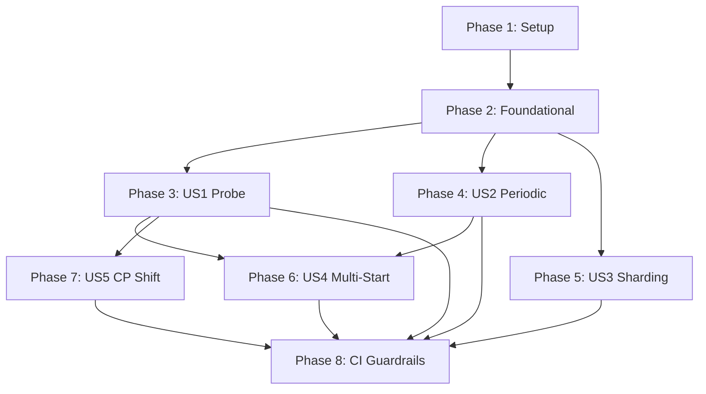

# Implementation Tasks: Probe Upgrade

**Branch**: `004-probe-upgrade` | **Date**: 2025-12-16  
**Spec**: [spec.md](spec.md) | **Plan**: [plan.md](plan.md)  
**Ground Truth**: `experiment/probe-upgrade` branch

---

## Task Summary

| Phase | Focus | Tasks |
|:---|:---|:---|
| Phase 1 | Setup | 3 |
| Phase 2 | Foundational | 4 |
| Phase 3 | US1: Low-Discrepancy Probe (P1) | 5 |
| Phase 4 | US2: Periodic Dimension Support (P2) | 4 |
| Phase 5 | US3: Stateless Parallel Sharding (P2) | 3 |
| Phase 6 | US4: Multi-Start NM Diversity (P3) | 4 |
| Phase 7 | US5: CP Shift Randomization (P3) | 2 |
| Phase 8 | CI Guardrails & Polish | 4 |
| **Total** | | **29** |

---

## Phase 1: Setup

- [x] T001 Ensure branch `004-probe-upgrade` is checked out and clean
- [x] T002 Verify ground truth branch `experiment/probe-upgrade` is accessible via `git fetch origin experiment/probe-upgrade`
- [x] T003 Create diff of all changes: `git diff main..origin/experiment/probe-upgrade --stat > probe_upgrade_diff.txt`

---

## Phase 2: Foundational (Blocking Prerequisites)

- [x] T004 [P] Cherry-pick `Scale::Periodic` enum variant to `crates/core/src/config.rs`
- [x] T005 [P] Cherry-pick `wrap01(x)` helper function to `crates/core/src/config.rs`
- [x] T006 [P] Cherry-pick `diff01(a, b)` helper function to `crates/core/src/config.rs`
- [x] T007 [P] Cherry-pick `circular_mean01(values)` helper function to `crates/core/src/config.rs`

**Verification**: `cargo build --package arqonhpo-core`

---

## Phase 3: US1 - Low-Discrepancy Probe (P1)

**Goal**: Replace p/1000 with Kronecker/Weyl sequence  
**Independent Test**: `pytest -k TestProbeOnlyQuality`

- [x] T008 [US1] Cherry-pick `PrimeSqrtSlopesRotConfig` struct to `crates/core/src/probe.rs`
- [x] T009 [US1] Cherry-pick `PrimeSqrtSlopesRotProbe` implementation to `crates/core/src/probe.rs`
- [x] T010 [US1] Cherry-pick `random_spice_ratio` logic (10% uniform points) to `crates/core/src/probe.rs`
- [x] T011 [US1] Wire `PrimeSqrtSlopesRotProbe` as default in `crates/core/src/machine.rs`
- [x] T012 [US1] Deprecate `UniformProbe` and `PrimeIndexProbe` with `#[deprecated]` attribute

**Verification**: `cargo test --package arqonhpo-core -- probe`

---

## Phase 4: US2 - Periodic Dimension Support (P2)

**Goal**: Circular arithmetic for angles/phases  
**Independent Test**: `pytest -k TestStructuredNMCorrectness`

- [x] T013 [US2] Cherry-pick periodic handling in probe sampling from `crates/core/src/probe.rs`
- [x] T014 [US2] Cherry-pick circular reflection logic in `crates/core/src/strategies/nelder_mead.rs`
- [x] T015 [US2] Cherry-pick circular expansion/contraction logic in `crates/core/src/strategies/nelder_mead.rs`
- [x] T016 [US2] Cherry-pick circular centroid (circular_mean01) in `crates/core/src/strategies/nelder_mead.rs`

**Verification**: `cargo test --package arqonhpo-core -- nelder`

---

## Phase 5: US3 - Stateless Parallel Sharding (P2)

**Goal**: Workers produce disjoint samples without coordination  
**Independent Test**: `python benchmarks/demo_parallel_sharding.py`

- [x] T017 [US3] Cherry-pick `ArqonProbe` class to `bindings/python/src/lib.rs`
- [x] T018 [US3] Update `bindings/python/python/arqonhpo/__init__.py` to export `ArqonProbe`
- [x] T019 [US3] Copy sharding demo script `benchmarks/demo_parallel_sharding.py` from ground truth

**Verification**: `conda run -n helios-gpu-118 python benchmarks/demo_parallel_sharding.py`

---

## Phase 6: US4 - Multi-Start NM Diversity (P3)

**Goal**: K parallel NM starts with farthest-point seeding  
**Independent Test**: `cargo test -- multi_start`

- [x] T020 [US4] Cherry-pick entire `crates/core/src/strategies/multi_start_nm.rs` from ground truth
- [x] T021 [US4] Update `crates/core/src/strategies/mod.rs` to export `multi_start_nm`
- [x] T022 [US4] Wire `MultiStartNM` strategy selection in `crates/core/src/machine.rs`
- [x] T023 [US4] Add config fields `multi_start_k`, `triage_budget`, `stall_threshold` to `crates/core/src/config.rs`

**Verification**: `cargo test --package arqonhpo-core -- multi_start`

---

## Phase 7: US5 - CP Shift Randomization (P3)

**Goal**: Cranley-Patterson shifts for stochastic QMC  
**Independent Test**: Verify same seed produces identical results

- [x] T024 [US5] Cherry-pick `cp_shift` config field handling in `crates/core/src/probe.rs`
- [x] T025 [US5] Cherry-pick auto-generate CP shift from seed logic in `crates/core/src/probe.rs`

**Verification**: `cargo test --package arqonhpo-core -- cp_shift`

---

## Phase 8: CI Guardrails & Polish

- [x] T026 Copy `benchmarks/test_probe_guardrails.py` from ground truth
- [x] T027 Copy `benchmarks/reporting/` directory from ground truth
- [x] T028 Run full guardrail test suite: `conda run -n helios-gpu-118 pytest benchmarks/test_probe_guardrails.py -v`
- [x] T029 Update documentation in `docs/docs/concepts/probe_deep_dive.md`

**Final Verification**: All 6 test classes pass (SC-001 through SC-006)

---

## Dependencies

---

## Parallel Execution Opportunities

| Tasks | Can Run Together | Reason |
|:---|:---|:---|
| T004, T005, T006, T007 | ✅ Yes | All modify different parts of `config.rs` |
| T008, T009, T010 | ✅ Yes | All additions to `probe.rs` |
| T013, T014, T015, T016 | ⚠️ Sequential | Same file, overlapping regions |
| T017, T018, T019 | ✅ Yes | Different files |
| T026, T027 | ✅ Yes | Independent copy operations |

---

## MVP Scope

**Minimum Viable Increment**: Phase 1 + Phase 2 + Phase 3 (US1)

This delivers:
- New Kronecker/Weyl probe algorithm
- Legacy probe deprecated
- Core quality improvement validated

All other phases are additive enhancements.
