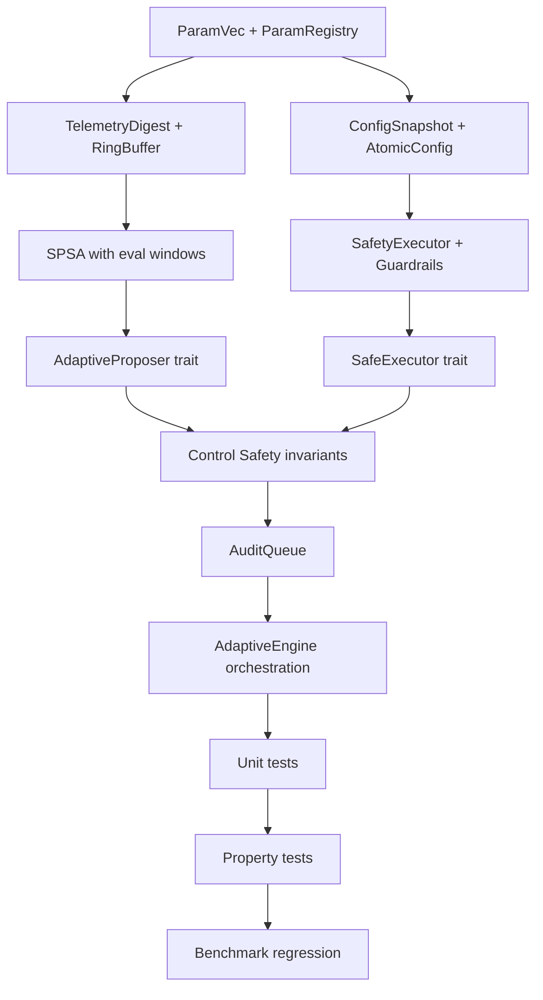

# Implementation Plan: Adaptive Engine

**Branch**: `005-adaptive-engine` | **Date**: 2025-12-16 | **Spec**: [spec.md](file:///home/irbsurfer/Projects/arqon/ArqonHPO/specs/005-adaptive-engine/spec.md)  
**Input**: Feature specification from `/specs/005-adaptive-engine/spec.md`

## Summary

Implement a **real-time parameter tuning engine** operating at microsecond latency within live control loops. The Adaptive Engine is the Tier 2 component in the ArqonHPO architecture, responsible for:

- Reading streaming telemetry via compact digests
- Proposing bounded parameter deltas using SPSA optimization
- Enforcing control safety invariants (anti-thrashing, stop-on-instability)
- Never directly mutating production state (Tier 1 boundary)

**Ground Truth**: Port and adapt from `origin/experiment/architecture-ideas:crates/core/src/adaptive_engine/` (5 files, 884 lines).

---

## Technical Context

**Language/Version**: Rust 1.75+ (edition 2021)  
**Primary Dependencies**: `rand_chacha` (ChaCha8Rng), `rand` (Bernoulli), `smallvec` (ParamVec), `crossbeam` (lock-free audit queue)  
**Storage**: N/A (in-memory only; audit events async-flushed to disk)  
**Testing**: `cargo test -p arqonhpo-core adaptive_engine`  
**Target Platform**: Linux x86_64 (primary), macOS (secondary)  
**Project Type**: Single Rust library crate with Python bindings (deferred)  
**Performance Goals**: T2_decision_us ≤ 1,000 µs (p99), T1_apply_us ≤ 100 µs (p99)  
**Constraints**: Zero heap allocation in T1 hot path, no blocking syscalls  
**Scale/Scope**: 1-16 parameters per config, single-node scope

---

## Constitution Check

*GATE: Must pass before Phase 0 research. Re-check after Phase 1 design.*

| Requirement | Spec Section | Status |
|:---|:---|:---|
| SPSA uses ±1 Bernoulli, ChaCha8Rng, α=0.602, γ=0.101 | §11.1 | ✅ PASS |
| All updates via SafetyExecutor; direct writes forbidden | §3.1, §11.2 | ✅ PASS |
| Atomic config with monotonic generation, zero-alloc hot path | §7, §11.3 | ✅ PASS |
| Telemetry digest ≤128 bytes | §6.1 | ✅ PASS |
| Tier 2 cannot mutate production state | §3.1 | ✅ PASS (trait enforced) |
| Tier mixing is merge-blocked | §3.1 | ✅ PASS (AdaptiveProposer/SafeExecutor separation) |
| Unbounded exploration/oscillation forbidden | §5 (Control Safety) | ✅ PASS (anti-thrashing rules) |
| T2_decision_us ≤ 1,000 µs, T1_apply_us ≤ 100 µs | §12 | ✅ PASS |
| Audit decoupled via ring buffer | §9 | ✅ PASS |
| Events include correlation IDs | §13 | ✅ PASS |
| Objective evaluation is pure and deterministic | §4.1 (SPSA) | ✅ PASS (ChaCha8Rng seeded) |
| Reproducibility metadata captured | §6.1 (config_generation) | ✅ PASS |
| Tests first for solver logic | §15 | ✅ PASS (40+ tests planned) |
| Observability: phase timings + mode rationale | §13 | ✅ PASS (structured events) |

**GATE RESULT**: ✅ ALL PASS — Proceed to Phase 0

---

## Project Structure

### Documentation (this feature)

```text
specs/005-adaptive-engine/
├── spec.md              # Feature specification (829 lines)
├── plan.md              # This file
├── research.md          # Phase 0 output
├── data-model.md        # Phase 1 output
├── quickstart.md        # Phase 1 output
├── contracts/           # Phase 1 output (Rust trait definitions)
├── checklists/
│   └── requirements.md  # Spec quality validation
└── tasks.md             # Phase 2 output (/speckit.tasks)
```

### Source Code (repository root)

```text
crates/core/src/
├── adaptive_engine/
│   ├── mod.rs              # AdaptiveEngine orchestration, re-exports
│   ├── proposer.rs         # AdaptiveProposer trait + impl
│   ├── executor.rs         # SafeExecutor trait + SafetyExecutor impl
│   ├── spsa.rs             # SPSA optimizer, state machine
│   ├── control_safety.rs   # Anti-thrashing, budget, regression detection
│   ├── config_atomic.rs    # AtomicConfig, ConfigSnapshot, ParamVec
│   ├── telemetry.rs        # TelemetryDigest, TelemetryRingBuffer
│   ├── audit.rs            # AuditQueue, audit events
│   └── homeostasis.rs      # HomeostasisCache (stub)
├── config.rs               # Domain, Scale (existing)
└── lib.rs                  # Add `pub mod adaptive_engine`

crates/core/src/tests/
└── test_adaptive_engine.rs # Unit + property tests

benches/
└── adaptive_engine_latency.rs  # Timing benchmarks
```

**Structure Decision**: Rust library crate (`crates/core`) with modular `adaptive_engine/` submodule. Matches existing ArqonHPO architecture.

---

## Phase 0: Research

**Objective**: Resolve any unknowns before implementation.

### Research Tasks

| Topic | Decision | Rationale |
|:---|:---|:---|
| ArcSwap vs RwLock | Use `RwLock<Arc<_>>` for v1 | Simpler, benchmark later for ArcSwap upgrade |
| SmallVec capacity | `SmallVec<[f64; 16]>` | Covers 99% of use cases without heap |
| Lock-free audit queue | `crossbeam::ArrayQueue` | Battle-tested, O(1) push |
| Objective aggregation | TrimmedMean(10%) default | Robust to outliers |
| Eval window sizing | 5 digests or 500ms | Balances responsiveness and noise rejection |

**Output**: No NEEDS CLARIFICATION items — Ground truth already proven in architecture-ideas branch.

---

## Phase 1: Design & Contracts

### Data Model

See `data-model.md` for detailed entity definitions.

**Key Entities**:

| Entity | Description |
|:---|:---|
| `ParamVec` | Dense parameter vector (SmallVec<[f64; 16]>) |
| `ConfigSnapshot` | Immutable config with generation counter |
| `TelemetryDigest` | Compact metrics (≤128 bytes) with config_generation |
| `Proposal` | ApplyPlus / ApplyMinus / Update / NoChange |
| `Violation` | Safety error types (9 variants) |
| `SafeMode` | Latch state with reason and exit condition |

### API Contracts

See `contracts/` for Rust trait definitions.

**Tier 2 Contract (AdaptiveProposer)**:
```rust
pub trait AdaptiveProposer {
    fn observe(&mut self, digest: TelemetryDigest) -> ProposalResult;
    fn current_perturbation(&self) -> Option<Perturbation>;
    fn iteration(&self) -> u64;
}
```

**Tier 1 Contract (SafeExecutor)**:
```rust
pub trait SafeExecutor {
    fn apply(&mut self, proposal: Proposal) -> Result<ApplyReceipt, Violation>;
    fn rollback(&mut self) -> Result<RollbackReceipt, Violation>;
    fn set_baseline(&mut self);
    fn snapshot(&self) -> ConfigSnapshot;
}
```

### Port Plan from Ground Truth

| Ground Truth File | Target File | Changes |
|:---|:---|:---|
| `mod.rs` (175 lines) | `mod.rs` + `proposer.rs` + `executor.rs` | Split into traits |
| `spsa.rs` (216 lines) | `spsa.rs` | Add eval window, staleness check |
| `safety_executor.rs` (217 lines) | `executor.rs` + `control_safety.rs` | Add anti-thrashing |
| `config_atomic.rs` (118 lines) | `config_atomic.rs` | Add ParamVec |
| `telemetry.rs` (158 lines) | `telemetry.rs` | Add config_generation |
| — | `audit.rs` | New: lock-free audit queue |
| — | `homeostasis.rs` | New: stub for future |

---

## Phase 2: Implementation Order



**Critical Path**: ParamVec → Telemetry → Config → SPSA → Traits → Control Safety → Tests

---

## Complexity Tracking

> No Constitution Check violations requiring justification.

| Item | Complexity | Notes |
|:---|:---|:---|
| Control Safety invariants | Medium | 5 rules, well-defined in spec |
| SPSA eval window handshake | Medium | State machine already proven |
| Trait-based tier separation | Low | Straightforward Rust patterns |
| ParamVec internal representation | Low | SmallVec is drop-in |
| Homeostasis cache | Stub | Deferred to post-005 |

---

## Verification Checkpoints

| Checkpoint | Acceptance |
|:---|:---|
| After ParamVec | `const_assert!(size_of::<ParamVec>() <= 256)` |
| After TelemetryDigest | `const_assert!(size_of::<TelemetryDigest>() <= 128)` |
| After SPSA | `test_spsa_deterministic`, `test_spsa_two_step_cycle` |
| After SafetyExecutor | All 4 violation types caught |
| After Control Safety | Anti-thrashing, stop-on-instability tests pass |
| After Integration | Convergence under drift, no oscillation |
| After Benchmarks | T2 ≤ 1000µs (p99), T1 ≤ 100µs (p99) |

---

## Next Steps

1. **Generate research.md** (Phase 0 output) — Documenting decisions
2. **Generate data-model.md** (Phase 1 output) — Entity definitions
3. **Generate contracts/** (Phase 1 output) — Rust trait definitions
4. **Generate quickstart.md** (Phase 1 output) — Usage examples
5. **Run `/speckit.tasks`** — Generate tasks.md for implementation
